# Functional Specification Document (FSD)
*Last Updated: October 7, 2025*

## 1. Introduction

### 1.1 Purpose
The Kinetic EV website serves as a comprehensive platform for electric vehicle sales, bookings, and customer service. This document outlines the functional specifications of the system, defining the capabilities, features, and interactions that the platform will provide to its users and administrators.

### 1.2 Scope
The system encompasses public website features, admin portal functionality, and integration with third-party services. This includes:
- Complete vehicle booking and test drive management
- Dealership network administration
- Customer relationship management
- Payment processing
- Communication systems
- Analytics and reporting

### 1.3 Business Context
Kinetic EV represents the digital transformation of the legendary Kinetic brand into the electric vehicle market. The platform serves as:
- Primary customer touchpoint for vehicle information and bookings
- Central management system for dealership network
- Integration hub for sales and customer service
- Data collection and analytics platform for business intelligence

### 1.4 Target Audience
This document is intended for:
- Development Team: For system implementation
- Project Managers: For resource planning and timeline management
- Quality Assurance: For test planning and validation
- Business Stakeholders: For feature verification and approval
- System Administrators: For understanding maintenance requirements

## 2. System Overview

### 2.1 Core System Architecture
The system is structured into three main components that work together to provide a seamless experience:
1. **Public Interface**: Customer-facing website and booking system
2. **Administrative Backend**: Management and control center
3. **Integration Layer**: Third-party service connections

### 2.2 Public Website Features
#### 2.2.1 Homepage
- **Product Showcase**
  - Dynamic vehicle image carousel
  - Featured specifications
  - Current offers and promotions
- **Feature Highlights**
  - Key selling points
  - Technology innovations
  - Environmental benefits
- **Quick Actions**
  - Direct booking access
  - Test drive scheduling
  - Dealer locator

#### 2.2.2 Vehicle Booking System
- **Test Drive Booking**
  - Location-based dealer assignment
  - Time slot selection
  - Automatic confirmation system
- **Vehicle Purchase**
  - Online booking with token amount
  - Variant selection
  - Color and accessory customization
- **Verification & Payment**
  - OTP-based phone verification
  - Secure payment gateway integration
  - Automated confirmation system
- **Post-Booking**
  - Email confirmations
  - SMS notifications
  - Booking tracking system

#### 2.2.3 Dealership Finder
- **Search Functionality**
  - Pincode-based search
  - City/State filtering
  - Current location detection
- **Map Integration**
  - Interactive Google Maps interface
  - Real-time dealer locations
  - Route planning and navigation
- **Dealer Information**
  - Contact details
  - Operating hours
  - Available services
  - Current inventory status

#### 2.2.4 Product Information
- **Vehicle Details**
  - Comprehensive specifications
  - Technical features
  - Performance metrics
- **Comparison Tools**
  - Variant comparison
  - Competitor comparison
  - Feature-wise breakdown
- **Interactive Elements**
  - 360° vehicle viewer
  - Color configurator
  - Range calculator

### 2.3 Admin Portal Features
#### 2.3.1 Dashboard
- **Real-time Analytics**
  - Daily booking statistics
  - Inquiry tracking metrics
  - Sales performance indicators
- **Activity Monitoring**
  - Recent bookings
  - Latest inquiries
  - Payment status updates
- **Performance Metrics**
  - Conversion rates
  - Regional performance
  - Dealer-wise statistics

#### 2.3.2 Customer Management
- **Database Features**
  - Comprehensive customer profiles
  - Booking history
  - Communication logs
- **Booking Administration**
  - Status management
  - Payment tracking
  - Document verification
- **Communication Tools**
  - Email templates
  - SMS notifications
  - Follow-up management

#### 2.3.3 Dealership Management
- **Network Administration**
  - Dealer onboarding
  - Territory assignment
  - Access control
- **Performance Tracking**
  - Sales monitoring
  - Target management
  - Service quality metrics
- **Inventory Control**
  - Stock management
  - Variant allocation
  - Transfer management

### 2.4 Integration Services
#### 2.4.1 Salesforce Integration
- **Lead Management**
  - Automated lead creation
  - Status synchronization
  - Activity tracking
- **Data Synchronization**
  - Bi-directional customer data sync
  - Booking status updates
  - Document transfer
- **Pipeline Management**
  - Sales stage tracking
  - Follow-up automation
  - Performance reporting

#### 2.4.2 Communication Services
- **Email System**
  - Transactional emails
  - Marketing communications
  - Automated notifications
- **SMS Gateway**
  - OTP verification
  - Status updates
  - Reminder system
- **Real-time Notifications**
  - Booking confirmations
  - Payment acknowledgments
  - Status changes

### 2.5 Feature Dependencies
- Vehicle Booking requires active OTP verification system
- Dealership Finder requires Google Maps integration
- Payment processing requires active payment gateway
- Email/SMS services require respective gateway integrations
- Admin access requires multi-factor authentication
- Salesforce sync requires active API connection

### 2.6 System Integration Flow
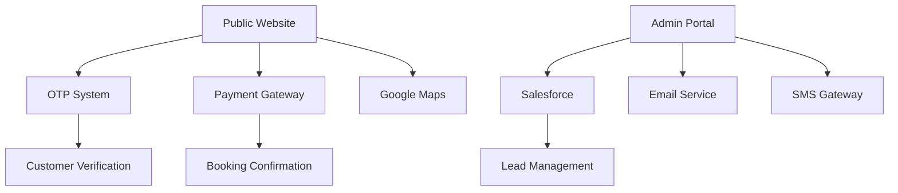

## 3. User Roles and Permissions

### 3.1 Role Hierarchy
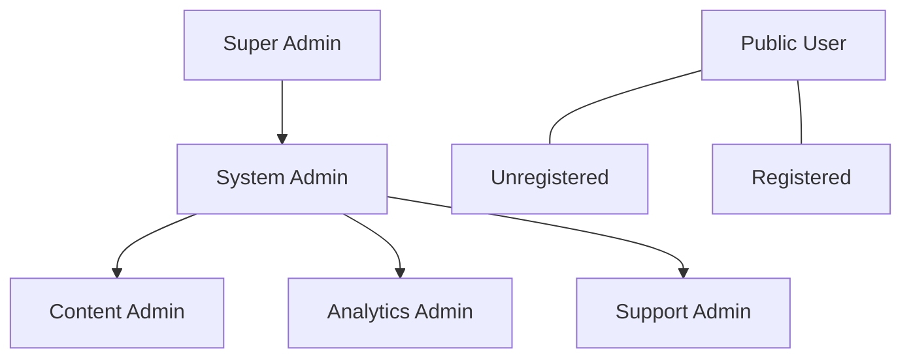

### 3.2 Access Control Levels

#### 3.2.1 Public Access (Level 0)
- View public pages and content
- Access vehicle information
- Use dealer locator
- View basic analytics (range calculator)

#### 3.2.2 Registered User (Level 1)
All Level 0 permissions plus:
- Personal profile management
- Booking history access
- Test drive scheduling
- Vehicle booking capability
- Payment processing
- Document uploads

#### 3.2.3 Support Admin (Level 2)
All Level 1 permissions plus:
- Customer inquiry management
- Booking status updates
- Basic report generation
- Customer communication tools

#### 3.2.4 Content Admin (Level 2)
- Content publishing rights
- Image/media management
- Product information updates
- Promotional content management
- News and updates posting

#### 3.2.5 Analytics Admin (Level 2)
- Dashboard access
- Report generation
- Data export capabilities
- Performance metrics viewing
- Trend analysis tools

#### 3.2.6 System Admin (Level 3)
All Level 2 permissions plus:
- User management
- Role assignment
- System configuration
- Integration management
- Security settings

#### 3.2.7 Super Admin (Level 4)
All Level 3 permissions plus:
- System-wide configuration
- Security policy management
- API key management
- Database administration
- Full audit capabilities

### 3.3 Permission Matrix

| Feature/Action              | Public | Registered | Support | Content | Analytics | System | Super |
|----------------------------|---------|------------|---------|---------|-----------|---------|--------|
| View Public Content        | ✅      | ✅         | ✅      | ✅      | ✅        | ✅      | ✅     |
| Make Bookings             | ❌      | ✅         | ✅      | ❌      | ❌        | ✅      | ✅     |
| Manage Profile            | ❌      | ✅         | ✅      | ✅      | ✅        | ✅      | ✅     |
| Handle Customer Support   | ❌      | ❌         | ✅      | ❌      | ❌        | ✅      | ✅     |
| Manage Content           | ❌      | ❌         | ❌      | ✅      | ❌        | ✅      | ✅     |
| Access Analytics         | ❌      | ❌         | ❌      | ❌      | ✅        | ✅      | ✅     |
| Configure System         | ❌      | ❌         | ❌      | ❌      | ❌        | ✅      | ✅     |
| Manage Users/Roles       | ❌      | ❌         | ❌      | ❌      | ❌        | ✅      | ✅     |
| Access API Keys          | ❌      | ❌         | ❌      | ❌      | ❌        | ❌      | ✅     |
| Database Administration  | ❌      | ❌         | ❌      | ❌      | ❌        | ❌      | ✅     |

### 3.4 Access Control Implementation

#### 3.4.1 Authentication Methods
- Public Users: None required
- Registered Users: Phone OTP
- Admin Users: Username/Password + 2FA

#### 3.4.2 Session Management
- Public: Basic session tracking
- Registered: Secure session with timeout
- Admin: Enhanced security session with activity tracking

#### 3.4.3 Access Restrictions
- IP-based restrictions for admin access
- Rate limiting for public APIs
- Concurrent session limitations
- Geographic restrictions for specific features

### 3.5 Security Measures
- Regular permission audits
- Activity logging for sensitive actions
- Automatic session termination
- Failed login attempt tracking
- Role-based action validation

## 4. Functional Requirements

### 4.1 Vehicle Booking Process

#### 4.1.1 Process Flow
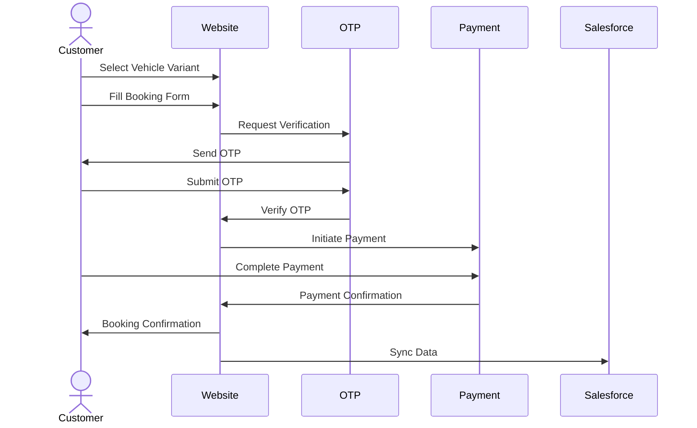

#### 4.1.2 Detailed Steps
1. Vehicle Selection
   - View available variants
   - Compare specifications
   - Select preferred color
   - Choose accessories

2. Booking Form
   - Personal details
   - Contact information
   - Preferred dealer
   - Special requests

3. Phone Verification
   - Enter mobile number
   - Receive OTP
   - Verify within 5 minutes
   - Max 3 retry attempts

4. Payment Process
   - View booking amount
   - Select payment method
   - Complete transaction
   - Receive payment confirmation

5. Confirmation
   - Booking reference number
   - Email confirmation
   - SMS notification
   - Dealer assignment

#### 4.1.3 Error Scenarios
- Invalid phone number
- OTP verification failure
- Payment failure
- Network timeout
- Data validation errors

### 4.2 Test Drive Booking

#### 4.2.1 Process Flow
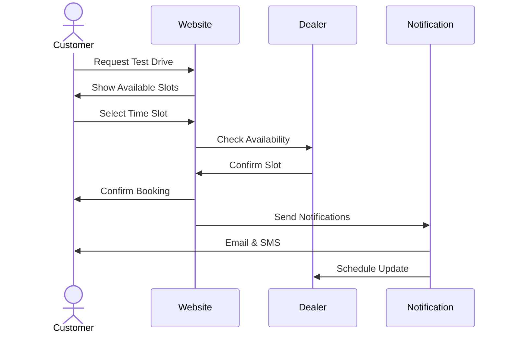

#### 4.2.2 Detailed Steps
1. Initial Request
   - Select vehicle variant
   - Choose preferred location
   - Indicate preferred dates

2. Slot Selection
   - View available time slots
   - Select preferred slot
   - Provide contact details

3. Verification
   - Validate phone number
   - Check slot availability
   - Confirm dealer capacity

4. Confirmation Process
   - Send booking confirmation
   - Schedule reminders
   - Share dealer details

#### 4.2.3 Error Handling
- Slot unavailability
- Dealer unavailability
- Location out of service area
- Scheduling conflicts
- Cancellation management

### 4.3 Dealership Location Services

#### 4.3.1 Process Flow
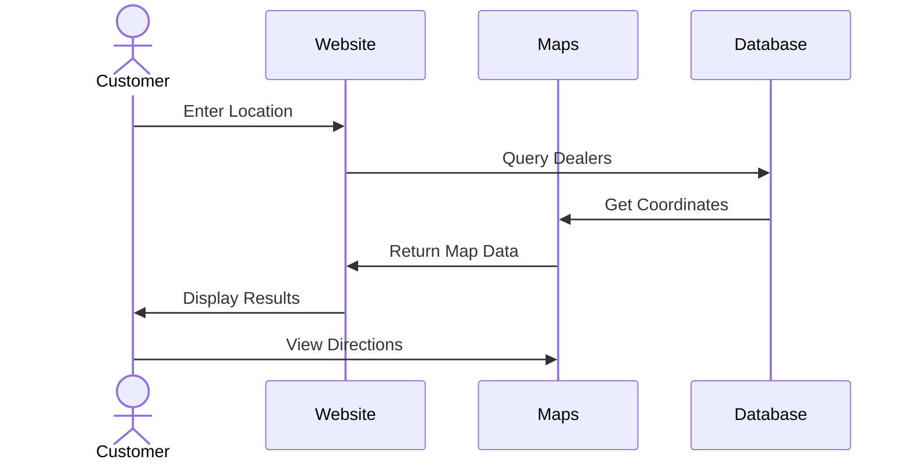

#### 4.3.2 Detailed Steps
1. Location Input
   - Enter pincode/city
   - Use current location
   - Select from suggestions

2. Search Process
   - Query dealer database
   - Calculate distances
   - Sort by proximity
   - Filter by services

3. Results Display
   - Show dealer list
   - Display on map
   - Show key information
   - Provide directions

#### 4.3.3 Implementation Details
1. Map Integration
   - Google Maps API
   - Real-time updates
   - Interactive markers
   - Route optimization

2. Dealer Information
   - Contact details
   - Operating hours
   - Available services
   - Current stock status

#### 4.3.4 Error Handling
- Invalid location
- No dealers found
- Map loading failure
- Network connectivity issues
- Geolocation errors

### 4.4 Data Validation Requirements

#### 4.4.1 Personal Information
- Name: 2-50 characters
- Phone: Valid Indian mobile number
- Email: Valid email format
- Address: Required fields

#### 4.4.2 Booking Information
- Variant: Must be in stock
- Color: Available options
- Dealer: Must be active
- Payment: Valid amount

### 4.5 System Response Requirements

#### 4.5.1 Performance Metrics
- Page Load: < 3 seconds
- Form Submit: < 2 seconds
- Payment Process: < 5 seconds
- Search Results: < 1 second

#### 4.5.2 Availability
- System Uptime: 99.9%
- Booking System: 24/7
- Maintenance Windows: Scheduled
- Backup Systems: Active

## 5. Content Management

### 5.1 Content Structure

#### 5.1.1 Vehicle Information
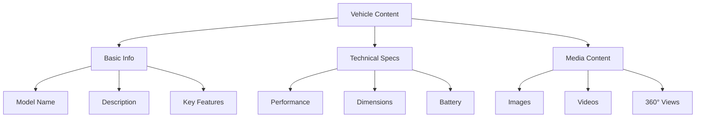

1. Product Information
   - Model name and variants
   - Color options
   - Key features
   - Price details

2. Technical Specifications
   - Performance metrics
   - Battery specifications
   - Charging details
   - Dimensions and weight

3. Media Assets
   - High-resolution images
   - Product videos
   - 360° view assets
   - Feature demonstrations

### 5.2 Marketing Content

#### 5.2.1 Content Types
1. Homepage Elements
   - Hero banners
   - Feature highlights
   - Call-to-action sections
   - News updates

2. Promotional Content
   - Special offers
   - Limited time deals
   - Regional promotions
   - Seasonal campaigns

#### 5.2.2 Content Workflow
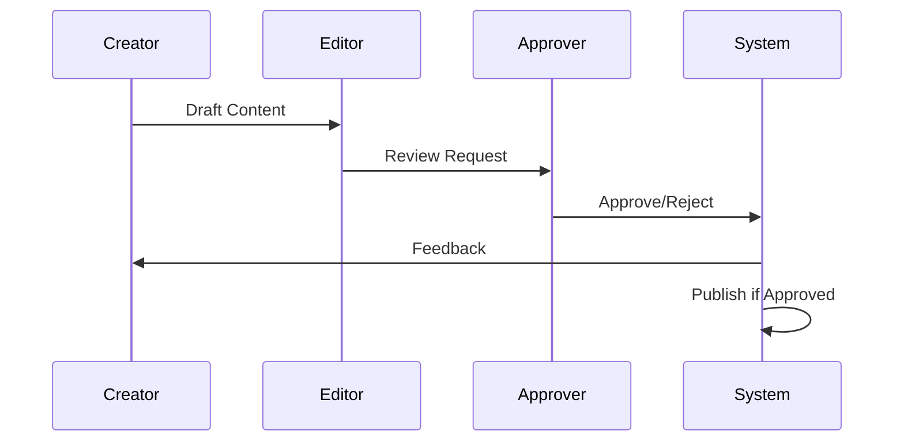

### 5.3 Legal Documents

#### 5.3.1 Document Types
1. Core Legal Documents
   - Privacy Policy
   - Terms and Conditions
   - Warranty Information
   - Refund Policy

2. Supporting Documents
   - Booking Terms
   - Test Drive Terms
   - Cancellation Policy
   - Data Usage Policy

#### 5.3.2 Version Control
- Document versioning
- Change tracking
- Approval history
- Publishing dates

### 5.4 Content Management Process

#### 5.4.1 Creation and Updates
1. Content Creation
   - Draft preparation
   - Media selection
   - SEO optimization
   - Mobile responsiveness

2. Review Process
   - Technical review
   - Legal compliance
   - Brand guidelines
   - Quality assurance

3. Publishing Workflow
   - Approval routing
   - Scheduling
   - Version control
   - Backup management

#### 5.4.2 Access Control
1. Role-based Access
   - Content creators
   - Editors
   - Approvers
   - Publishers

2. Permission Levels
   - View only
   - Edit draft
   - Review/Approve
   - Publish rights

### 5.5 Content Guidelines

#### 5.5.1 Technical Requirements
1. Image Specifications
   - Format: JPG/PNG/WebP
   - Resolution: Min 1920x1080
   - Size: Max 2MB
   - Optimization: WebP conversion

2. Video Requirements
   - Format: MP4/WebM
   - Quality: 1080p minimum
   - Duration: As per content type
   - Compression: H.264

#### 5.5.2 SEO Requirements
1. Meta Information
   - Title tags
   - Meta descriptions
   - Alt text for images
   - Schema markup

2. Content Structure
   - Heading hierarchy
   - Keyword optimization
   - Internal linking
   - URL structure

### 5.6 Maintenance and Archival

#### 5.6.1 Content Lifecycle
1. Active Content
   - Regular reviews
   - Update schedule
   - Performance tracking
   - A/B testing

2. Archive Process
   - Archival criteria
   - Storage method
   - Retention period
   - Recovery process

#### 5.6.2 Quality Assurance
1. Regular Audits
   - Content accuracy
   - Link validation
   - Media integrity
   - Performance impact

2. Compliance Checks
   - Legal requirements
   - Brand guidelines
   - Industry standards
   - Accessibility standards

## 6. Communication System

### 6.1 System Architecture

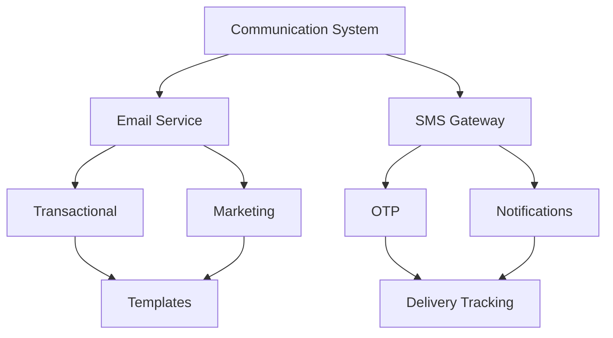

### 6.2 Email Communication

#### 6.2.1 Transactional Emails
1. Account Related
   - OTP Verification
   - Account Creation
   - Profile Updates
   - Password Reset

2. Booking Related
   - Booking Confirmation
   - Payment Receipt
   - Booking Updates
   - Test Drive Schedule

3. Service Related
   - Support Ticket Updates
   - Query Responses
   - Feedback Requests
   - Service Reminders

#### 6.2.2 Email Templates
| Template ID | Purpose | Trigger | Priority |
|------------|---------|---------|-----------|
| ACC_OTP | Account Verification | OTP Request | High |
| BOOK_CONF | Booking Confirmation | New Booking | High |
| PAY_RCPT | Payment Receipt | Payment Success | High |
| TEST_SCH | Test Drive Schedule | Test Drive Booking | Medium |
| FEED_REQ | Feedback Request | Post Service | Low |

### 6.3 SMS Communication

#### 6.3.1 SMS Categories
1. Authentication
   - OTP Delivery
   - Login Verification
   - Action Confirmation

2. Transactional
   - Booking Status
   - Payment Confirmation
   - Schedule Updates

3. Notifications
   - Reminders
   - Updates
   - Alerts

#### 6.3.2 SMS Templates
```json
{
    "OTP_MSG": {
        "template": "Your OTP for Kinetic EV is: {otp}. Valid for 5 mins.",
        "priority": "HIGH",
        "retry": true
    },
    "BOOK_CONF": {
        "template": "Booking confirmed! ID: {bookingId}. Amount: ₹{amount}",
        "priority": "HIGH",
        "retry": true
    },
    "TEST_REMIND": {
        "template": "Reminder: Test drive scheduled for {date} at {time}",
        "priority": "MEDIUM",
        "retry": false
    }
}
```

### 6.4 Communication Workflows

#### 6.4.1 OTP Verification Flow
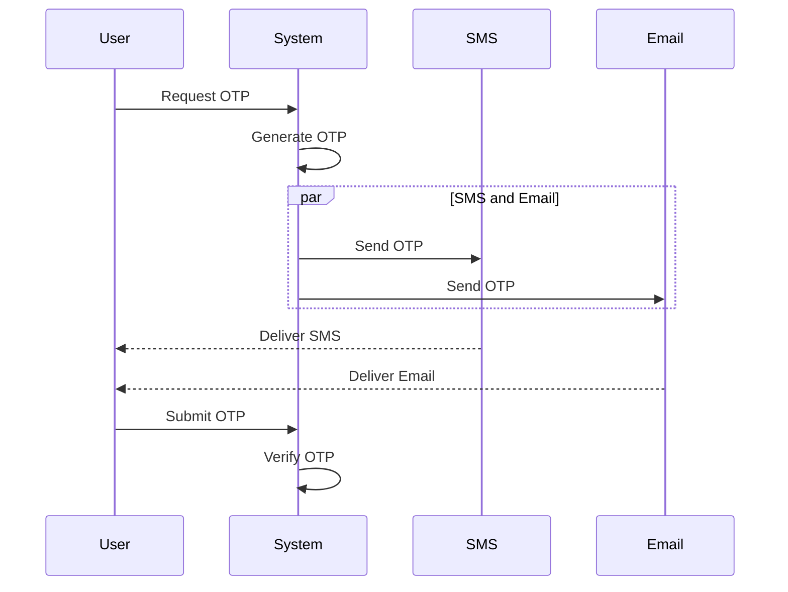

#### 6.4.2 Booking Communication Flow
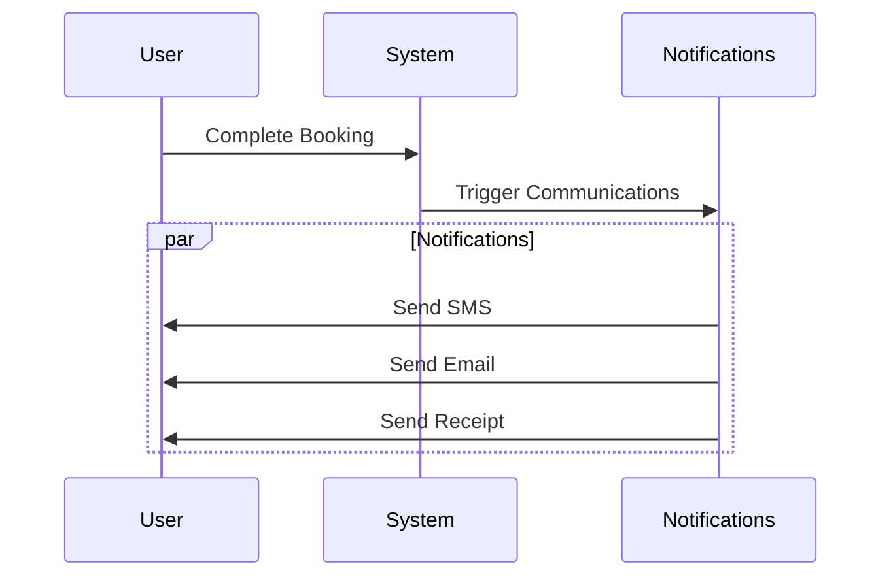

### 6.5 Delivery Management

#### 6.5.1 Retry Logic
1. SMS Retries
   - High Priority: 3 attempts
   - Medium Priority: 2 attempts
   - Low Priority: 1 attempt

2. Email Retries
   - Soft Bounce: 3 attempts
   - Hard Bounce: No retry
   - Interval: 5 minutes

#### 6.5.2 Delivery Tracking
1. Status Tracking
   - Sent
   - Delivered
   - Failed
   - Bounced
   - Opened (Email)

2. Performance Metrics
   - Delivery Rate
   - Open Rate (Email)
   - Failure Rate
   - Response Time

### 6.6 Template Management

#### 6.6.1 Template Structure
```json
{
    "template_id": "string",
    "type": "EMAIL|SMS",
    "subject": "string",
    "content": "string",
    "variables": ["array"],
    "version": "number",
    "active": "boolean"
}
```

#### 6.6.2 Version Control
- Template versioning
- A/B testing support
- Change history
- Rollback capability

### 6.7 Security Measures

#### 6.7.1 Data Protection
- PII encryption
- Secure transmission
- Data retention policies
- Access logging

#### 6.7.2 Compliance
- SPAM regulations
- Opt-out management
- Content guidelines
- Privacy policies

### 6.8 Error Handling

#### 6.8.1 Common Scenarios
- Invalid contact details
- Gateway failures
- Template errors
- Rate limiting

#### 6.8.2 Resolution Process
- Error logging
- Alternate channels
- Manual intervention
- Customer notification

## 7. Security Features

### 7.1 Security Architecture

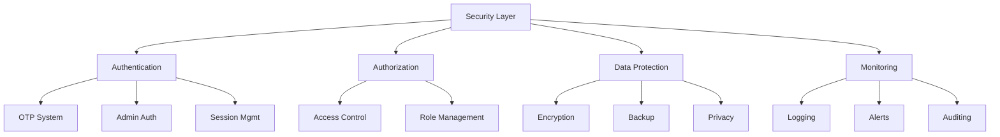

### 7.2 Authentication System

#### 7.2.1 Public User Authentication
1. OTP Verification
   - Phone number validation
   - OTP generation (6 digits)
   - 5-minute validity
   - Max 3 retry attempts
   - Cooldown period: 1 minute

2. Session Management
   - Session timeout: 30 minutes
   - Secure session tokens
   - Device fingerprinting
   - Concurrent session limits

#### 7.2.2 Admin Authentication
1. Primary Authentication
   - Username/password
   - Password complexity requirements
   - Password expiry: 90 days
   - Password history: Last 5

2. Two-Factor Authentication
   - TOTP-based 2FA
   - Backup codes
   - Device verification
   - IP-based restrictions

### 7.3 Authorization Controls

#### 7.3.1 Access Control Matrix
| Resource | Public | User | Admin | Super Admin |
|----------|--------|------|-------|-------------|
| View Content | ✅ | ✅ | ✅ | ✅ |
| Book Vehicle | ❌ | ✅ | ✅ | ✅ |
| Manage Content | ❌ | ❌ | ✅ | ✅ |
| System Config | ❌ | ❌ | ❌ | ✅ |

#### 7.3.2 Role-Based Access
1. Permission Types
   - Read
   - Write
   - Execute
   - Admin

2. Resource Types
   - Public content
   - User data
   - System settings
   - Admin functions

### 7.4 Data Protection

#### 7.4.1 Data Classification
1. Public Data
   - Vehicle information
   - Dealer locations
   - Marketing content

2. Sensitive Data
   - User profiles
   - Booking details
   - Payment information

3. Critical Data
   - Authentication credentials
   - System configurations
   - Encryption keys

#### 7.4.2 Encryption Standards
1. Data in Transit
   - TLS 1.3
   - Perfect Forward Secrecy
   - Strong cipher suites
   - Certificate pinning

2. Data at Rest
   - AES-256 encryption
   - Secure key management
   - Database encryption
   - File system encryption

### 7.5 Security Monitoring

#### 7.5.1 Logging Requirements
1. System Logs
   - Authentication attempts
   - Authorization decisions
   - System changes
   - Error conditions

2. User Activity Logs
   - Login attempts
   - Critical actions
   - Data modifications
   - Access patterns

#### 7.5.2 Security Alerts
1. Alert Triggers
   - Failed login attempts
   - Unusual access patterns
   - System errors
   - Policy violations

2. Alert Priorities
   - P1: Security breaches
   - P2: Policy violations
   - P3: Unusual activities
   - P4: System warnings

### 7.6 Threat Mitigation

#### 7.6.1 Common Threats
1. Authentication Attacks
   - Brute force protection
   - Rate limiting
   - Account lockouts
   - IP blocking

2. Data Security
   - Input validation
   - Output encoding
   - SQL injection prevention
   - XSS protection

#### 7.6.2 Security Controls
1. Preventive Controls
   - Input validation
   - Access control
   - Encryption
   - Security headers

2. Detective Controls
   - Activity monitoring
   - Security logging
   - Intrusion detection
   - File integrity monitoring

### 7.7 Compliance Requirements

#### 7.7.1 Data Privacy
1. User Rights
   - Data access
   - Data portability
   - Right to erasure
   - Consent management

2. Data Protection
   - Data minimization
   - Storage limitations
   - Processing restrictions
   - Transfer controls

#### 7.7.2 Security Standards
1. Payment Security
   - PCI DSS compliance
   - Secure payment flow
   - Card data protection
   - Audit logging

2. Application Security
   - OWASP compliance
   - Security testing
   - Vulnerability management
   - Incident response

### 7.8 Incident Response

#### 7.8.1 Response Process
1. Detection
   - Monitoring systems
   - Alert triggers
   - User reports
   - Automated detection

2. Response Steps
   - Initial assessment
   - Containment
   - Investigation
   - Recovery

#### 7.8.2 Recovery Procedures
1. System Recovery
   - Backup restoration
   - Service restoration
   - Data validation
   - System hardening

2. Post-Incident
   - Root cause analysis
   - Security improvements
   - Documentation updates
   - Team training

## 8. Performance Requirements

### 8.1 System Performance Metrics

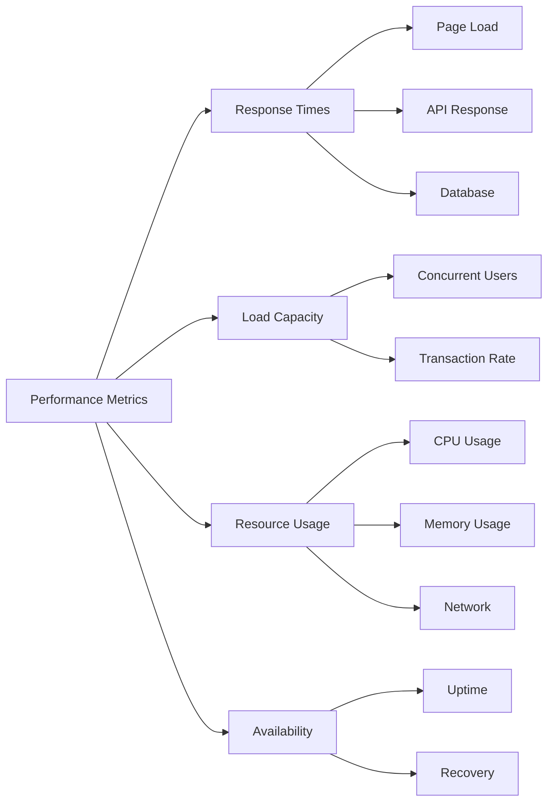

### 8.2 Response Time Requirements

#### 8.2.1 Web Interface
| Operation | Target Time | Maximum Time | 95th Percentile |
|-----------|------------|--------------|-----------------|
| Page Load (First) | < 2.5s | 3.0s | 2.8s |
| Page Load (Cached) | < 1.0s | 1.5s | 1.2s |
| Search Results | < 1.5s | 2.0s | 1.8s |
| Form Submission | < 3.0s | 4.0s | 3.5s |
| Image Loading | < 1.0s | 2.0s | 1.5s |

#### 8.2.2 API Performance
| Operation | Target Time | Maximum Time | 95th Percentile |
|-----------|------------|--------------|-----------------|
| Authentication | < 0.5s | 1.0s | 0.8s |
| Data Retrieval | < 1.0s | 1.5s | 1.2s |
| Payment Processing | < 3.0s | 5.0s | 4.0s |
| File Upload | < 4.0s | 6.0s | 5.0s |

### 8.3 System Capacity

#### 8.3.1 Concurrent Users
- Base Capacity: 1,000 concurrent users
- Peak Capacity: 2,500 concurrent users
- Growth Support: 25% annual increase
- Session Duration: Average 15 minutes

#### 8.3.2 Transaction Volume
- Normal Load: 100 transactions/second
- Peak Load: 250 transactions/second
- Daily Transactions: Up to 5 million
- Monthly Growth: 5% projected

### 8.4 Resource Utilization

#### 8.4.1 Server Resources
| Resource | Normal Usage | Peak Usage | Threshold |
|----------|--------------|------------|-----------|
| CPU | < 60% | < 80% | 90% |
| Memory | < 70% | < 85% | 90% |
| Disk I/O | < 65% | < 80% | 85% |
| Network | < 50% | < 75% | 80% |

#### 8.4.2 Database Performance
- Query Response: < 100ms
- Connection Pool: 200 connections
- Deadlock Rate: < 0.1%
- Index Usage: > 95%

### 8.5 Scalability Requirements

#### 8.5.1 Horizontal Scaling
- Auto-scaling triggers
  - CPU usage > 70% for 5 minutes
  - Memory usage > 80% for 5 minutes
  - Request queue > 100 for 2 minutes
- Scale-out time: < 3 minutes
- Scale-in time: < 5 minutes

#### 8.5.2 Vertical Scaling
- Resource Expansion
  - CPU cores: Up to 32
  - RAM: Up to 128GB
  - Storage: Up to 2TB
- Zero-downtime upgrades

### 8.6 Availability Metrics

#### 8.6.1 System Uptime
- Target Uptime: 99.95%
- Planned Downtime: < 4 hours/month
- Unplanned Downtime: < 1 hour/month
- Recovery Time Objective (RTO): < 1 hour

#### 8.6.2 Fault Tolerance
- Failover Time: < 30 seconds
- Data Loss Prevention: RPO < 5 minutes
- Redundancy: N+1 configuration
- Geographic Distribution: Multi-region

### 8.7 Monitoring and Alerts

#### 8.7.1 Performance Monitoring
- Real-time metrics collection
- Historical trend analysis
- Performance anomaly detection
- Resource usage tracking

#### 8.7.2 Alert Thresholds
| Metric | Warning | Critical | Action |
|--------|----------|-----------|---------|
| Response Time | > 2s | > 4s | Auto-scale |
| CPU Usage | > 70% | > 85% | Resource allocation |
| Memory Usage | > 80% | > 90% | Memory cleanup |
| Error Rate | > 1% | > 3% | Investigation |

## 9. Compliance Requirements

### 9.1 Compliance Framework

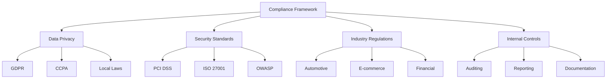

### 9.2 Data Privacy Compliance

#### 9.2.1 GDPR Requirements
| Requirement | Implementation | Validation |
|-------------|---------------|------------|
| Right to Access | User dashboard | Quarterly audit |
| Right to Erasure | Account deletion | Monthly check |
| Data Portability | Export function | Technical review |
| Consent Management | Opt-in system | Legal review |
| Data Minimization | Field review | Annual audit |

#### 9.2.2 CCPA Compliance
1. Consumer Rights
   - Right to know
   - Right to delete
   - Right to opt-out
   - Right to non-discrimination

2. Business Obligations
   - Privacy notice
   - Response procedures
   - Verification process
   - Training program

### 9.3 Payment Security Standards

#### 9.3.1 PCI DSS Requirements
1. Network Security
   - Firewall configuration
   - System passwords
   - Encrypted transmission
   - Anti-virus software

2. Data Protection
   - Encryption standards
   - Access control
   - Physical security
   - Data retention

3. Vulnerability Management
   - Security testing
   - System updates
   - Security policies
   - Risk assessment

#### 9.3.2 Payment Gateway Integration
1. Technical Requirements
   - API compliance
   - Error handling
   - Transaction logs
   - Reconciliation

2. Security Measures
   - Tokenization
   - 3D Secure
   - Fraud detection
   - Chargeback handling

### 9.4 Automotive Industry Standards

#### 9.4.1 Dealership Requirements
1. Documentation
   - Vehicle information
   - Pricing transparency
   - Service history
   - Warranty details

2. Consumer Protection
   - Fair pricing
   - Clear terms
   - Complaint handling
   - Refund policy

### 9.5 E-commerce Regulations

#### 9.5.1 Online Sales Requirements
1. Transaction Documentation
   - Order confirmation
   - Invoice generation
   - Receipt issuance
   - Return policy

2. Consumer Rights
   - Cooling-off period
   - Return process
   - Refund handling
   - Dispute resolution

### 9.6 Audit and Documentation

#### 9.6.1 Internal Controls
1. Regular Audits
   - Monthly security scans
   - Quarterly compliance review
   - Annual system audit
   - Penetration testing

2. Documentation Requirements
   - Policy documents
   - Procedure manuals
   - Training materials
   - Audit reports

#### 9.6.2 Reporting Requirements
1. Compliance Reports
   - Security incidents
   - Data breaches
   - Audit findings
   - Corrective actions

2. Performance Metrics
   - Response times
   - Resolution rates
   - Compliance scores
   - Risk assessments

### 9.7 Training and Awareness

#### 9.7.1 Employee Training
1. Required Training
   - Data privacy
   - Security awareness
   - Compliance basics
   - Incident response

2. Documentation
   - Training records
   - Certification tracking
   - Refresher schedule
   - Assessment results

#### 9.7.2 Partner Requirements
1. Compliance Standards
   - Security policies
   - Data handling
   - Incident reporting
   - Regular audits

2. Documentation
   - Agreement terms
   - Compliance records
   - Audit reports
   - Training certificates

## 10. System Interfaces

### 10.1 System Architecture Overview

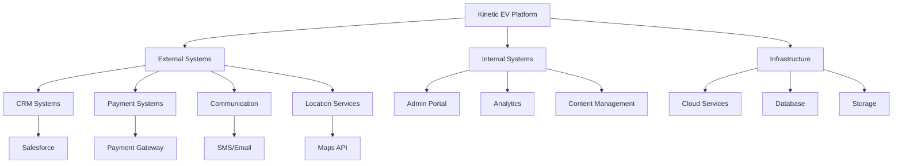

### 10.2 External Integrations

#### 10.2.1 CRM Integration (Salesforce)
1. Data Flow
   ```mermaid
   sequenceDiagram
       participant K as Kinetic Platform
       participant S as Salesforce CRM
       
       K->>S: Customer Data Update
       S->>K: Lead Status Update
       K->>S: Booking Information
       S->>K: Customer Feedback
   ```

2. Integration Points
   | Operation | Type | Frequency | SLA |
   |-----------|------|-----------|-----|
   | Lead Creation | REST API | Real-time | < 2s |
   | Status Update | Webhook | Event-based | < 1s |
   | Data Sync | Batch | Every 6h | < 30m |
   | Analytics | REST API | Daily | < 15m |

#### 10.2.2 Payment Systems
1. Payment Gateway Integration
   - Transaction processing
   - Refund handling
   - Subscription management
   - Payment status webhooks

2. Security Requirements
   - PCI DSS compliance
   - Tokenization
   - 3D Secure 2.0
   - Fraud detection

#### 10.2.3 Communication Services
1. SMS Gateway
   - Provider: Twilio
   - Features:
     - OTP delivery
     - Booking confirmations
     - Status updates
     - Promotional messages

2. Email Service
   - Provider: SendGrid
   - Features:
     - Transactional emails
     - Marketing campaigns
     - Email templates
     - Delivery tracking

#### 10.2.4 Location Services
1. Google Maps Integration
   - Dealership locator
   - Route planning
   - Distance calculation
   - Geocoding services

2. Service Requirements
   | Feature | API Endpoint | Rate Limit | Cache TTL |
   |---------|-------------|------------|-----------|
   | Geocoding | /geocode | 50/s | 24h |
   | Places | /places | 100/s | 12h |
   | Directions | /directions | 75/s | 1h |
   | Static Maps | /maps | 200/s | 48h |

### 10.3 Internal Systems

#### 10.3.1 Admin Portal
1. Core Components
   ```mermaid
   graph LR
       A[Admin Portal] --> B[User Management]
       A --> C[Content Management]
       A --> D[Order Management]
       A --> E[Analytics Dashboard]
       
       B --> B1[Role Management]
       B --> B2[Access Control]
       
       C --> C1[Vehicle Catalog]
       C --> C2[Marketing Content]
       
       D --> D1[Booking Management]
       D --> D2[Payment Processing]
       
       E --> E1[Reports]
       E --> E2[Metrics]
   ```

2. Integration Points
   | Module | API Group | Auth Level | Rate Limit |
   |--------|-----------|------------|------------|
   | Users | /api/admin/users | Admin | 100/min |
   | Content | /api/admin/content | Editor | 200/min |
   | Orders | /api/admin/orders | Manager | 150/min |
   | Analytics | /api/admin/analytics | Analyst | 50/min |

#### 10.3.2 Analytics System
1. Data Collection
   - User behavior tracking
   - Performance metrics
   - Business KPIs
   - System health

2. Reporting Capabilities
   - Real-time dashboards
   - Scheduled reports
   - Custom analytics
   - Export functionality

### 10.4 Infrastructure Services

#### 10.4.1 Cloud Services
1. AWS Services
   - EC2: Application servers
   - RDS: Database
   - S3: File storage
   - CloudFront: CDN

2. Monitoring Services
   - CloudWatch: Metrics
   - New Relic: APM
   - Datadog: Logging
   - PagerDuty: Alerts

#### 10.4.2 Database Systems
1. Primary Database
   - Type: PostgreSQL
   - Version: 14.x
   - Replication: Active-passive
   - Backup: Daily

2. Cache Layer
   - Redis clusters
   - Cache invalidation
   - Session storage
   - Rate limiting

### 10.5 API Standards

#### 10.5.1 RESTful API Guidelines
1. Authentication
   - JWT tokens
   - API keys
   - OAuth 2.0
   - Rate limiting

2. Response Format
   ```json
   {
     "status": "success",
     "data": {},
     "meta": {
       "pagination": {},
       "version": "1.0"
     }
   }
   ```

#### 10.5.2 API Documentation
1. Documentation Tools
   - OpenAPI/Swagger
   - API versioning
   - Example requests
   - Error codes

2. Testing Requirements
   - Unit tests
   - Integration tests
   - Performance tests
   - Security tests

## 11. Document Control

### 11.1 Document Information

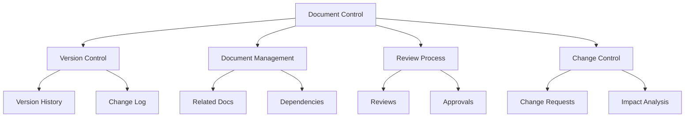

#### 11.1.1 Document Metadata
| Attribute | Value |
|-----------|-------|
| Document Title | Functional Specification Document (FSD) |
| Document ID | KIN-FSD-2025-001 |
| Version | 1.0 |
| Release Date | October 7, 2025 |
| Document Owner | Akshay Khandelwal |
| Last Updated | October 7, 2025 |
| Next Review | January 7, 2026 |
| Classification | Internal Use Only |
| Status | Draft |

### 11.2 Version History

#### 11.2.1 Version Log
| Version | Date | Author | Description | Approver |
|---------|------|---------|-------------|-----------|
| 1.0 | Oct 7, 2025 | Akshay Khandelwal | Initial Release | Pending |
| 0.9 | Oct 1, 2025 | Akshay Khandelwal | Final Draft | Team Review |
| 0.5 | Sep 15, 2025 | Akshay Khandelwal | Mid-Stage Draft | Internal Review |
| 0.1 | Sep 1, 2025 | Akshay Khandelwal | Initial Draft | N/A |

#### 11.2.2 Change Log
| Date | Section | Change Description | Author |
|------|---------|-------------------|---------|
| Oct 7, 2025 | All | Initial document structure | Akshay Khandelwal |
| Oct 7, 2025 | Security | Enhanced security features | Akshay Khandelwal |
| Oct 7, 2025 | Performance | Added detailed metrics | Akshay Khandelwal |
| Oct 7, 2025 | Interfaces | Updated system interfaces | Akshay Khandelwal |

### 11.3 Related Documentation

#### 11.3.1 Technical Documentation
1. Core Documents
   - Technical Specification Document (TSD-001)
   - System Architecture Document (SAD-001)
   - Database Design Document (DDD-001)
   - API Documentation (API-001)

2. Supporting Documents
   - Security Guidelines (SEC-001)
   - Performance Benchmarks (PERF-001)
   - Integration Guide (INT-001)
   - Test Plan (TEST-001)

#### 11.3.2 User Documentation
1. Administrative Guides
   - System Administration Guide (ADM-001)
   - Operations Manual (OPS-001)
   - Maintenance Guide (MNT-001)
   - Troubleshooting Guide (TBL-001)

2. End User Documents
   - User Manual (USR-001)
   - Quick Start Guide (QSG-001)
   - FAQ Document (FAQ-001)
   - Training Material (TRN-001)

### 11.4 Document Management

#### 11.4.1 Access Control
| Role | View | Edit | Approve | Admin |
|------|------|------|---------|-------|
| Project Manager | ✅ | ✅ | ✅ | ❌ |
| Technical Lead | ✅ | ✅ | ✅ | ❌ |
| Developer | ✅ | ❌ | ❌ | ❌ |
| QA Team | ✅ | ❌ | ❌ | ❌ |
| Document Admin | ✅ | ✅ | ✅ | ✅ |

#### 11.4.2 Review Process
1. Review Stages
   - Technical Review
   - Peer Review
   - Stakeholder Review
   - Final Approval

2. Review Schedule
   - Initial Review: Within 1 week of draft
   - Periodic Review: Every 3 months
   - Change-triggered Review: As needed

### 11.5 Change Control

#### 11.5.1 Change Request Process
1. Request Submission
   - Change description
   - Justification
   - Impact analysis
   - Risk assessment

2. Approval Workflow
   ```mermaid
   graph LR
       A[Change Request] --> B[Initial Review]
       B --> C[Impact Analysis]
       C --> D[Technical Review]
       D --> E[Stakeholder Approval]
       E --> F[Implementation]
       F --> G[Documentation]
   ```

#### 11.5.2 Change Implementation
1. Implementation Steps
   - Documentation update
   - Version control
   - Communication
   - Training (if required)

2. Quality Control
   - Accuracy check
   - Completeness verification
   - Consistency review
   - Format validation

### 11.6 Distribution Control

#### 11.6.1 Distribution List
| Role | Department | Format | Frequency |
|------|------------|--------|-----------|
| Project Manager | Management | Digital | Real-time |
| Technical Lead | Engineering | Digital | Real-time |
| Developers | Engineering | Digital | On update |
| QA Team | Quality | Digital | On update |
| Stakeholders | Various | Digital | Monthly |

#### 11.6.2 Distribution Methods
1. Digital Distribution
   - Version control system
   - Document management system
   - Email notifications
   - Team portal

2. Access Control
   - Role-based access
   - Audit logging
   - Version tracking
   - Read receipts