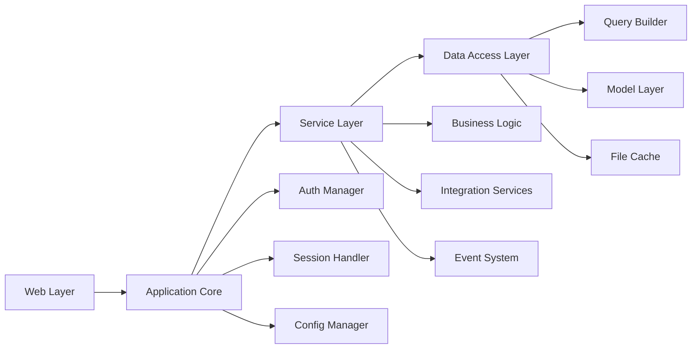
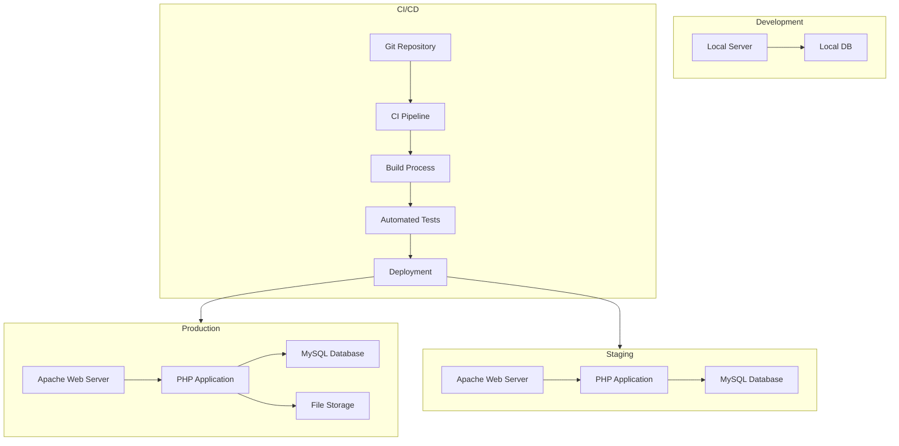
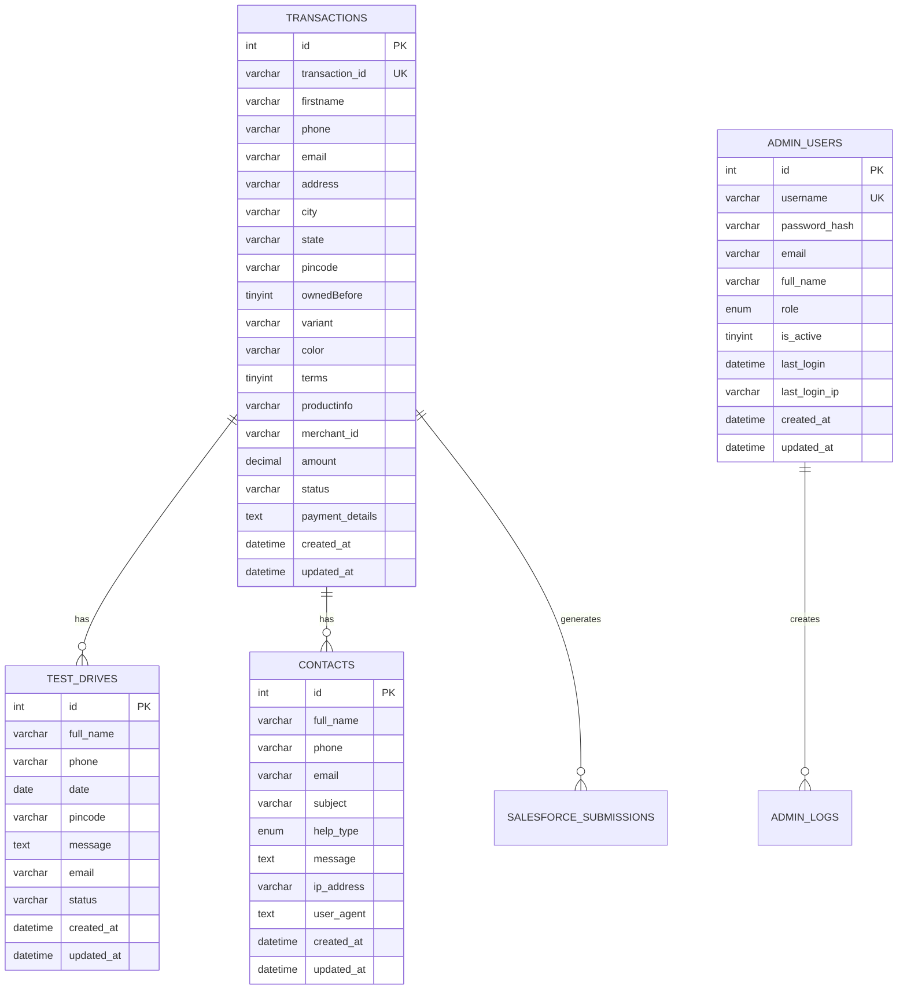
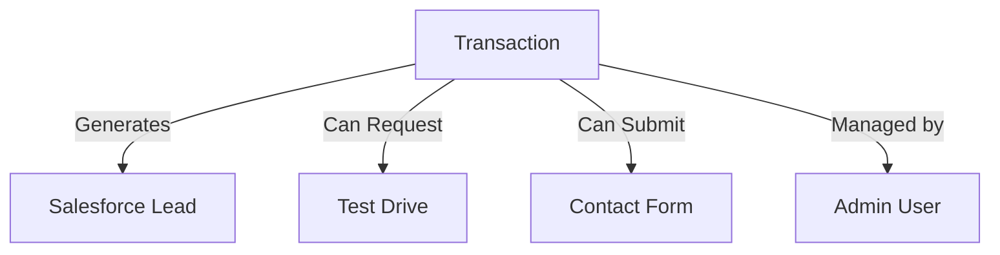
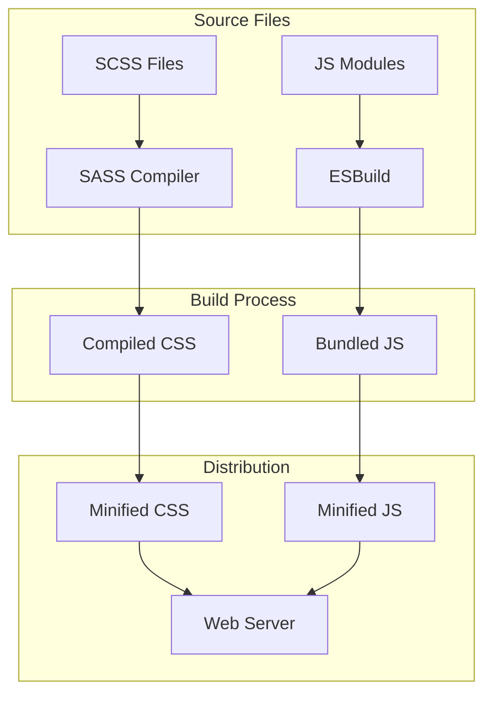
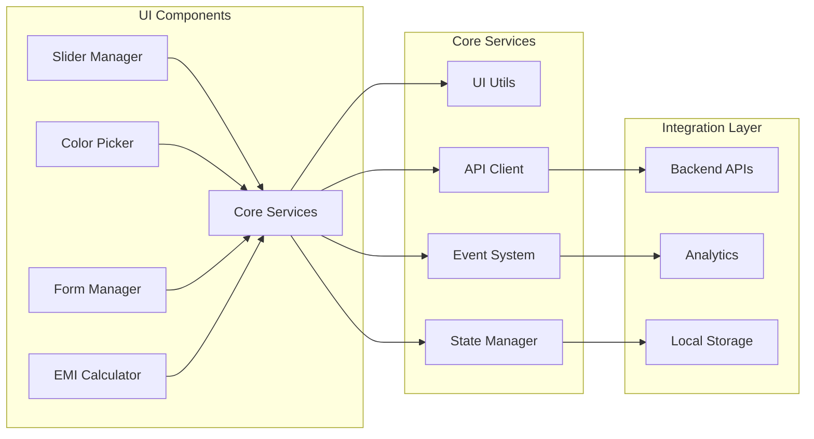
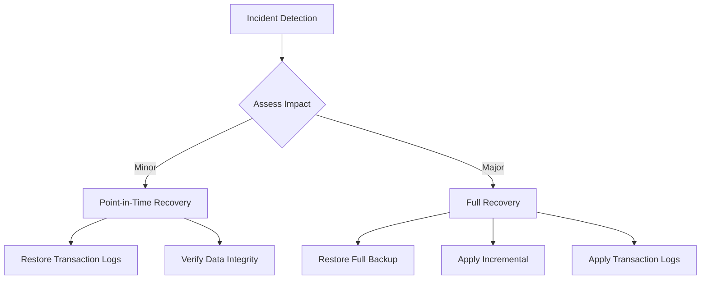
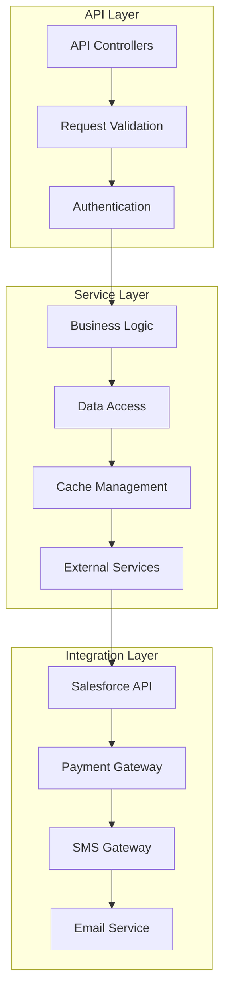
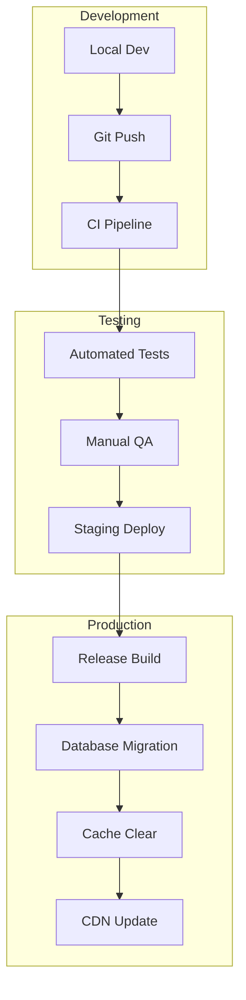
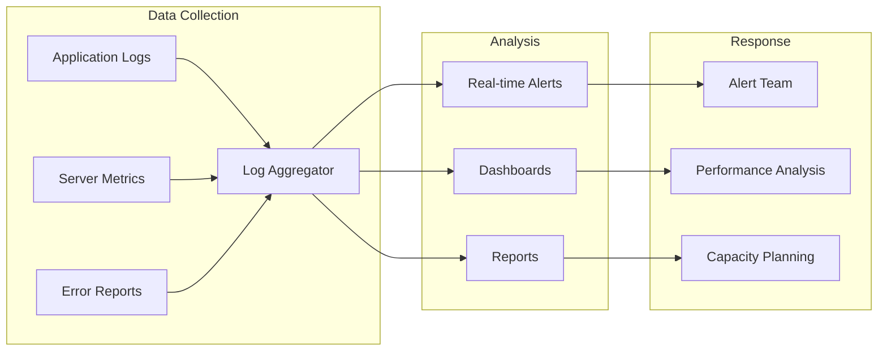

# Technical Specification Document (TSD)
*Last Updated: October 7, 2025*

## 1. System Architecture

### 1.1 High-Level Architecture

```mermaid
graph TB
    subgraph Client Layer
        A1[Web Browser] --> A2[Mobile Browser]
        A1 --> A3[Admin Interface]
    end
    
    subgraph Application Layer
        B1[Apache Web Server] --> B2[PHP Application]
        B2 --> B3[Session Handler]
        B3 --> B4[File Cache]
    end
    
    subgraph Service Layer
        C1[Authentication] --> C2[Business Logic]
        C2 --> C3[Data Access]
        C3 --> C4[Integration Services]
    end
    
    subgraph Data Layer
        D1[MySQL Database] --> D2[File Storage]
    end
    
    subgraph External Services
        E1[Salesforce] --> E2[Payment Gateway]
        E2 --> E3[SMS Gateway]
        E3 --> E4[Email Service]
    end
    
    Client Layer --> Application Layer
    Application Layer --> Service Layer
    Service Layer --> Data Layer
    Service Layer --> External Services
```

### 1.2 Technology Stack

#### 1.2.1 Core Technologies
| Component | Technology | Version | Purpose |
|-----------|------------|---------|----------|
| Backend | PHP | 8.1+ | Application logic |
| Database | MySQL | 5.7+ | Data storage |
| Cache | File Cache | - | Session/Data caching |
| SMS | OTP Service | - | Mobile verification |
| Email | Multiple Handlers | - | Email notifications |
| CRM | Salesforce | - | Customer management |
| Web Server | Apache | 2.4+ | HTTP server |

#### 1.2.2 Frontend Technologies
| Component | Technology | Version | Purpose |
|-----------|------------|---------|----------|
| HTML | HTML5 | Latest | Structure |
| CSS | CSS3/SASS | Latest | Styling |
| JavaScript | ES6+ | Latest | Interactivity |
| Build Tool | Node.js | 16+ | Build system |
| Package Manager | npm | 8+ | Dependency management |

#### 1.2.3 Development Tools
| Tool | Version | Purpose |
|------|---------|----------|
| Git | 2.35+ | Version control |
| Composer | 2.0+ | PHP dependency management |
| PHPUnit | 9.5+ | Unit testing |
| ESLint | 8.0+ | JavaScript linting |
| PHPCS | 3.7+ | PHP code standards |

### 1.3 System Components

#### 1.3.1 Core Components


#### 1.3.2 Directory Structure
```
K2/
├── php/                    # 🎯 Application Root (All backend code)
│   ├── admin/             # Admin portal & management
│   │   ├── api/          # Admin API endpoints
│   │   ├── assets/       # Admin-specific assets
│   │   └── components/   # Admin UI components
│   ├── api/               # RESTful API endpoints
│   │   ├── process-payment.php   # Payment processing
│   │   ├── check-status.php      # Payment status
│   │   ├── save-contact.php      # Contact form
│   │   ├── submit-test-drive.php # Test drive booking
│   │   ├── generate-otp.php      # OTP generation
│   │   ├── verify-otp.php        # OTP verification
│   │   └── distance-check.php    # Distance calculation
│   ├── components/        # Reusable PHP components
│   │   ├── layout.php     # Main layout wrapper
│   │   ├── head.php       # HTML head section
│   │   ├── header.php     # Site header
│   │   ├── footer.php     # Site footer
│   │   ├── modals.php     # Modal dialogs
│   │   └── scripts.php    # JavaScript includes
│   ├── email-templates/   # Email template files
│   │   ├── contact-admin-email.tpl.php
│   │   ├── contact-customer-email.tpl.php
│   │   ├── test-ride-admin-email.tpl.php
│   │   ├── test-ride-customer-email.tpl.php
│   │   ├── transaction-failure-admin.tpl.php
│   │   ├── transaction-failure-customer.tpl.php
│   │   ├── transaction-success-admin.tpl.php
│   │   └── transaction-success-customer.tpl.php
│   ├── logs/              # Application logs
│   └── vendor/            # Composer dependencies
├── src/                   # Frontend source code
│   ├── scss/             # SCSS stylesheets
│   ├── scripts/          # JavaScript modules
│   ├── public/           # Static assets
│   │   ├── images/       # Image assets
│   │   ├── fonts/        # Font files
│   │   └── icons/        # Icon files
│   └── dist/             # Compiled assets (auto-generated)
│       ├── css/          # Compiled CSS
│       └── js/           # Compiled JavaScript
├── scripts/              # Build & deployment scripts
├── tests/               # Test files (if applicable)
├── config.php           # Main application configuration
├── production-config.php # Production environment settings
├── prod.htaccess        # Production Apache configuration
├── robots.txt           # SEO robots configuration
└── sitemap.xml         # SEO sitemap
```

### 1.4 Deployment Architecture



### 1.5 Infrastructure Specifications

### 1.6 Core Configuration Examples

#### 1.6.1 Environment Detection
```php
// Environment detection from config.php
function determineEnvironment()
{
    global $FORCE_ENVIRONMENT;

    // Method 0: Check for manual override
    if ($FORCE_ENVIRONMENT !== null) {
        return $FORCE_ENVIRONMENT;
    }

    // Method 1: Check by domain
    $domain = $_SERVER['HTTP_HOST'] ?? '';
    if (strpos($domain, 'test.kineticev.in') !== false) {
        return 'test';
    } elseif (strpos($domain, 'kineticev.in') !== false) {
        return 'production';
    }

    // Default to development
    return 'development';
}
```

#### 1.6.2 Application Initialization
```php
// Admin portal initialization (php/admin/index.php)
// Configure session settings
ini_set('session.cookie_lifetime', 3600); // 1 hour
ini_set('session.cookie_secure', 0); // Set to 1 if using HTTPS
ini_set('session.cookie_httponly', 1); // Prevent XSS
ini_set('session.use_strict_mode', 1); // Prevent session fixation

session_start();

// Load configuration and core services
require_once __DIR__ . '/../config.php';
require_once __DIR__ . '/../Logger.php';
require_once __DIR__ . '/AdminHandler.php';

$logger = Logger::getInstance();

// Initialize core services
$adminHandler = new AdminHandler($config);
$emailHandler = new EmailHandler();
$smsService = new SmsService();

// Add comprehensive cache control headers
header('Cache-Control: no-cache, no-store, must-revalidate, max-age=0, private');
header('Pragma: no-cache');
header('Expires: Thu, 01 Jan 1970 00:00:00 GMT');
```

#### 1.6.3 Frontend Initialization
```javascript
// Main application initialization (src/scripts/app.js)
import { SliderManager } from './modules/SliderManager.js';
import { Viewer360ColorPicker } from './modules/Viewer360ColorPicker.js';
import { LegendFormManager } from './modules/LegendFormManager.js';
import { EmiCalculator } from './modules/EmiCalculator.js';
import { VideoPlaylistManager } from './modules/VideoPlaylistManager.js';
import { PincodeManager } from './modules/PincodeManager.js';
import { BookingFormHandler } from './modules/BookingFormHandler.js';

// Initialize when DOM is ready
document.addEventListener('DOMContentLoaded', function () {
    // Initialize UI modules
    const uiModules = {
        slider: SliderManager.initializeSlider(),
        colorPicker: Viewer360ColorPicker.init(),
        formManager: LegendFormManager.init(),
        emiCalc: EmiCalculator.init(),
        videoPlayer: VideoPlaylistManager.init(),
        pincodeManager: PincodeManager.init(),
        bookingForm: BookingFormHandler.init()
    };

    // Initialize event listeners
    SliderManager.initializeResizeListener();
    PincodeManager.initializeAddressAutocomplete();
    PincodeManager.initializeCityRestriction();

    // Log initialization status
    console.log('All modules initialized:', Object.keys(uiModules));
});
```

#### 1.6.4 Database Configuration
```php
// Database configuration example (config.php)
$CONFIG['database'] = [
    'host' => getenv('DB_HOST') ?: 'localhost',
    'dbname' => getenv('DB_NAME') ?: 'kineticev',
    'username' => getenv('DB_USER') ?: 'root',
    'password' => getenv('DB_PASS') ?: '',
    'port' => getenv('DB_PORT') ?: 3306,
    'charset' => 'utf8mb4',
    'collation' => 'utf8mb4_unicode_ci'
];

// Database table creation example (php/admin/AdminHandler.php)
private function createAdminTable()
{
    try {
        $sql = "CREATE TABLE IF NOT EXISTS admin_users (
            id INT AUTO_INCREMENT PRIMARY KEY,
            username VARCHAR(50) NOT NULL UNIQUE,
            password_hash VARCHAR(255) NOT NULL,
            email VARCHAR(100),
            full_name VARCHAR(100),
            role ENUM('super_admin', 'admin', 'viewer') DEFAULT 'admin',
            is_active TINYINT(1) DEFAULT 1,
            last_login DATETIME NULL,
            last_login_ip VARCHAR(45) NULL,
            created_at DATETIME DEFAULT CURRENT_TIMESTAMP,
            updated_at DATETIME DEFAULT CURRENT_TIMESTAMP ON UPDATE CURRENT_TIMESTAMP
        )";
        $this->conn->exec($sql);
    } catch (Exception $e) {
        $this->logger->error('[ADMIN_HANDLER] Table creation error', [
            'error' => $e->getMessage()
        ]);
        throw $e;
    }
}
```

#### 1.6.5 Security Configuration
```php
// Production security headers
header('Cache-Control: no-cache, no-store, must-revalidate, max-age=0, private');
header('Pragma: no-cache');
header('Expires: Thu, 01 Jan 1970 00:00:00 GMT');
header('X-Frame-Options: SAMEORIGIN');
header('X-XSS-Protection: 1; mode=block');
header('X-Content-Type-Options: nosniff');
```

### 1.7 Infrastructure Specifications

#### 1.7.1 Server Requirements
| Environment | CPU | RAM | Storage | Network |
|-------------|-----|-----|----------|---------|
| Production | 8 cores | 32GB | 500GB SSD | 1Gbps |
| Staging | 4 cores | 16GB | 250GB SSD | 500Mbps |
| Development | 2 cores | 8GB | 100GB SSD | N/A |

#### 1.5.2 Resource Requirements
| Component | Development | Staging | Production |
|-----------|------------|---------|------------|
| CPU | 2 cores | 4 cores | 8 cores |
| Memory | 4GB | 8GB | 16GB |
| Storage | 20GB | 100GB | 500GB |
| Database | 1GB | 5GB | 20GB |
| Cache Storage | 1GB | 2GB | 5GB |

## 2. Database Design

### 2.1 Database Architecture



### 2.2 Table Schemas

#### 2.2.1 Transactions Table
```sql
CREATE TABLE transactions (
    id INT AUTO_INCREMENT PRIMARY KEY,
    transaction_id VARCHAR(100) NOT NULL UNIQUE,
    firstname VARCHAR(255) NOT NULL,
    phone VARCHAR(20) NOT NULL,
    email VARCHAR(255) NOT NULL,
    address VARCHAR(255),
    city VARCHAR(100),
    state VARCHAR(100),
    pincode VARCHAR(20),
    ownedBefore TINYINT(1),
    variant VARCHAR(50),
    color VARCHAR(50),
    terms TINYINT(1),
    productinfo VARCHAR(255),
    merchant_id VARCHAR(100),
    amount DECIMAL(10,2) NOT NULL,
    status VARCHAR(50) NOT NULL,
    payment_details TEXT,
    created_at DATETIME NOT NULL,
    updated_at DATETIME
);
```

#### 2.2.2 Test Drives Table
```sql
CREATE TABLE test_drives (
    id INT AUTO_INCREMENT PRIMARY KEY,
    full_name VARCHAR(255) NOT NULL,
    phone VARCHAR(20) NOT NULL,
    date DATE NOT NULL,
    pincode VARCHAR(20) NOT NULL,
    message TEXT NOT NULL,
    email VARCHAR(255) NOT NULL,
    status VARCHAR(50) DEFAULT 'pending' COMMENT 'Test drive request status',
    created_at DATETIME NOT NULL,
    updated_at DATETIME DEFAULT CURRENT_TIMESTAMP ON UPDATE CURRENT_TIMESTAMP
);
```

#### 2.2.3 Contacts Table
```sql
CREATE TABLE contacts (
    id INT AUTO_INCREMENT PRIMARY KEY,
    full_name VARCHAR(255) NOT NULL,
    phone VARCHAR(20) NOT NULL,
    email VARCHAR(255) NOT NULL,
    subject VARCHAR(255) DEFAULT NULL COMMENT 'Contact form subject/title',
    help_type ENUM('support', 'enquiry', 'dealership', 'others') NOT NULL,
    message TEXT NOT NULL,
    ip_address VARCHAR(45),
    user_agent TEXT,
    created_at DATETIME NOT NULL DEFAULT CURRENT_TIMESTAMP,
    updated_at DATETIME DEFAULT CURRENT_TIMESTAMP ON UPDATE CURRENT_TIMESTAMP
);
```

#### 2.2.4 Admin Users Table
```sql
CREATE TABLE admin_users (
    id INT AUTO_INCREMENT PRIMARY KEY,
    username VARCHAR(50) NOT NULL UNIQUE,
    password_hash VARCHAR(255) NOT NULL,
    email VARCHAR(100),
    full_name VARCHAR(100),
    role ENUM('super_admin', 'admin', 'viewer') DEFAULT 'admin',
    is_active TINYINT(1) DEFAULT 1,
    last_login DATETIME NULL,
    last_login_ip VARCHAR(45) NULL,
    created_at DATETIME DEFAULT CURRENT_TIMESTAMP,
    updated_at DATETIME DEFAULT CURRENT_TIMESTAMP ON UPDATE CURRENT_TIMESTAMP
);
```

### 2.3 Database Relationships

#### 2.3.1 Transaction Relationships


## 4. Frontend Architecture

### 4.1 Overview

The frontend architecture follows a modular design pattern with a focus on performance and maintainability. The build system uses Node.js tooling for compilation and optimization of assets.



### 4.2 Build System

#### 4.2.1 JavaScript Build (esbuild)
```javascript
// scripts/js-watch.js
const esbuild = require("esbuild");

function build(filePath) {
    esbuild.build({
        entryPoints: [filePath],
        outfile: path.join(outputDir, "main.js"),
        bundle: true,
        minify: true,
        sourcemap: true,
        target: "es2017"
    });
}
```

#### 4.2.2 SCSS Build (sass)
```javascript
// scripts/sass-watch.js
const sass = require("sass");

function compile(filePath) {
    const result = sass.compile(filePath, {
        style: "compressed",
        sourceMap: true,
        quietDeps: true,
        loadPaths: ['node_modules'],
        charset: false
    });
}
```

### 4.3 Asset Organization

```
src/
├── scss/              # SCSS stylesheets
│   ├── main.scss      # Main stylesheet entry
│   ├── _variables.scss # Variables and configuration
│   ├── _mixins.scss   # Reusable mixins
│   ├── _forms.scss    # Form styles
│   └── ...           # Feature-specific styles
├── scripts/          # JavaScript modules
│   ├── main.js       # Main entry point
│   └── modules/      # Feature modules
│       ├── SliderManager.js
│       ├── Viewer360ColorPicker.js
│       ├── VideoPlaylistManager.js
│       └── ...
├── public/           # Static assets
│   ├── images/       # Image assets
│   ├── fonts/        # Font files
│   └── icons/        # Icon files
└── dist/             # Compiled assets
    ├── css/          # Compiled CSS
    └── js/           # Compiled JavaScript
```

### 4.4 Module Architecture

The frontend codebase follows a modular architecture where each feature is encapsulated in its own module. This promotes code reusability, maintainability, and testability.

#### 4.4.1 Core Modules
```javascript
// Example module pattern (src/scripts/modules/SliderManager.js)
export class SliderManager {
    static init() {
        // Initialize slider functionality
        this.bindEvents();
        this.setupDefaults();
    }

    static initializeSlider() {
        // Initialize specific slider instance
        return new Slider({
            autoplay: true,
            speed: 500,
            adaptiveHeight: true
        });
    }

    static initializeResizeListener() {
        // Handle responsive behavior
        window.addEventListener('resize', this.handleResize.bind(this));
    }
}
```

#### 4.4.2 Module Integration
```javascript
// Main application initialization
import { SliderManager } from './modules/SliderManager.js';
import { Viewer360ColorPicker } from './modules/Viewer360ColorPicker.js';
import { VideoPlaylistManager } from './modules/VideoPlaylistManager.js';
import { PincodeManager } from './modules/PincodeManager.js';
import { BookingFormHandler } from './modules/BookingFormHandler.js';

document.addEventListener('DOMContentLoaded', function() {
    // Initialize core modules
    SliderManager.init();
    Viewer360ColorPicker.init();
    VideoPlaylistManager.init();
    PincodeManager.init();
    BookingFormHandler.init();
});
```

### 4.5 Core Frontend Services

The application provides several core services that are used across different modules:



### 4.6 Component Integration

PHP components are integrated with the frontend through a centralized script management system:

```php
// components/scripts.php
function renderScripts() {
?>
<!-- Main JavaScript bundle with all dependencies included -->
<script src="/js/main.js?v=<?php echo time(); ?>" 
        type="application/javascript"></script>
<?php
}
```

### 4.7 Performance Optimization

The frontend implementation includes several performance optimization strategies:

#### 4.7.1 Build Optimization
- JavaScript bundling and tree-shaking with esbuild
- CSS minification and optimization
- Source map generation for debugging
- Automatic file watching and rebuilding

#### 4.7.2 Runtime Optimization
- Lazy loading of heavy components
- Efficient DOM manipulation
- Event delegation patterns
- Resource preloading
- Image optimization
- CSS containment for complex animations
- GPU-accelerated transitions
- Debounced event handlers

#### 4.7.3 Loading Strategy
- Critical CSS inlining
- Deferred script loading
- Progressive image loading
- Font loading optimization
- Asset preloading for key resources

### 4.8 Code Quality & Maintenance

#### 4.8.1 Code Standards
- ESLint configuration for JavaScript
- Stylelint for SCSS/CSS
- EditorConfig for consistent formatting
- Prettier for automatic code formatting

#### 4.8.2 Documentation
- JSDoc comments for JavaScript modules
- SCSS documentation with SassDoc
- Component usage examples
- API integration documentation

## 5. Backend Implementation

### 2.4 Indexing Strategy

#### 2.4.1 Primary Indices
| Table | Index | Type | Purpose |
|-------|-------|------|---------|
| transactions | id | PRIMARY | Unique identifier |
| transactions | transaction_id | UNIQUE | Business identifier |
| test_drives | id | PRIMARY | Unique identifier |
| contacts | id | PRIMARY | Unique identifier |
| admin_users | id | PRIMARY | Unique identifier |
| admin_users | username | UNIQUE | Login identifier |

#### 2.4.2 Secondary Indices
| Table | Index | Type | Columns | Purpose |
|-------|-------|------|---------|---------|
| transactions | phone_email | INDEX | (phone, email) | Quick lookup |
| transactions | status_date | INDEX | (status, created_at) | Status filtering |
| test_drives | phone_date | INDEX | (phone, date) | Booking lookup |
| contacts | help_type | INDEX | (help_type) | Category filtering |

### 2.5 Data Migration Strategy

#### 2.5.1 Migration Process


## 3. Backend Implementation

### 3.1 Core Service Layer

#### 3.1.1 Service Architecture
```mermaid
graph TB
    subgraph Core Services
        A1[Authentication Service] --> A2[Database Service]
        A2 --> A3[Email Service]
        A3 --> A4[SMS Service]
        A4 --> A5[Salesforce Service]
        A5 --> A6[OTP Service]
    end
    
    subgraph Business Logic
        B1[Admin Handler] --> B2[Database Handler]
        B2 --> B3[Migration Handler]
        B3 --> B4[Error Handler]
    end
    
    subgraph Integration Layer
        C1[API Controllers] --> C2[Service Layer]
        C2 --> C3[Database Layer]
    end
    
    Core Services --> Business Logic
    Business Logic --> Integration Layer
```

#### 3.1.2 Core Service Classes
| Service | File | Purpose | Key Features |
|---------|------|---------|--------------|
| Database | `DatabaseHandler.php` | Database operations | Connection pooling, Query builder, Transaction management |
| Email | `EmailHandler.php` | Email communications | Template system, Queue management, Retry mechanism |
| SMS | `SmsService.php` | SMS notifications | Provider integration, Rate limiting, Delivery tracking |
| OTP | `OtpService.php` | OTP management | Generation, Validation, Expiry handling |
| Salesforce | `SalesforceService.php` | CRM integration | Lead creation, Status sync, Error handling |

### 3.2 API Implementation

#### 3.2.1 API Endpoints Structure
```php
// Example API endpoint structure (verify-otp.php)
<?php
header('Content-Type: application/json');
header('Access-Control-Allow-Origin: *');
header('Access-Control-Allow-Methods: POST, OPTIONS');
header('Access-Control-Allow-Headers: Content-Type');

// Handle preflight OPTIONS request
if ($_SERVER['REQUEST_METHOD'] === 'OPTIONS') {
    http_response_code(200);
    exit();
}

// Only allow POST requests
if ($_SERVER['REQUEST_METHOD'] !== 'POST') {
    http_response_code(405);
    echo json_encode(['success' => false, 'error' => 'Method not allowed']);
    exit();
}

try {
    // Initialize services
    $otpService = new OtpService();
    $logger = Logger::getInstance();
    
    // Process request
    $input = json_decode(file_get_contents('php://input'), true);
    
    // Validate input
    if (!isset($input['phone']) || !isset($input['otp'])) {
        throw new Exception('Missing required fields');
    }
    
    // Business logic
    $result = $otpService->verifyOtp($input['phone'], $input['otp']);
    
    // Response
    echo json_encode(['success' => true, 'data' => $result]);
    
} catch (Exception $e) {
    $logger->error('[API] OTP verification failed', [
        'error' => $e->getMessage()
    ]);
    http_response_code(400);
    echo json_encode(['success' => false, 'error' => $e->getMessage()]);
}
```

#### 3.2.2 API Endpoints Overview
| Endpoint | Method | Purpose | Authentication |
|----------|--------|---------|----------------|
| `/api/generate-otp.php` | POST | Generate OTP | None |
| `/api/verify-otp.php` | POST | Verify OTP | None |
| `/api/save-contact.php` | POST | Save contact form | OTP Verified |
| `/api/submit-test-drive.php` | POST | Book test drive | OTP Verified |
| `/api/process-payment.php` | POST | Process payment | OTP Verified |
| `/api/check-status.php` | GET | Check payment status | Token Based |

### 3.3 Authentication System

#### 3.3.1 Admin Authentication
```php
// Admin authentication implementation
class AdminHandler {
    public function authenticateUser($username, $password) {
        try {
            $stmt = $this->conn->prepare(
                "SELECT id, username, password_hash, role, is_active 
                 FROM admin_users 
                 WHERE username = ? AND is_active = 1"
            );
            $stmt->execute([$username]);
            $user = $stmt->fetch();
            
            if (!$user || !password_verify($password, $user['password_hash'])) {
                throw new Exception('Invalid credentials');
            }
            
            // Update last login
            $this->updateLastLogin($user['id']);
            
            return [
                'id' => $user['id'],
                'username' => $user['username'],
                'role' => $user['role']
            ];
            
        } catch (Exception $e) {
            $this->logger->error('[AUTH] Authentication failed', [
                'username' => $username,
                'error' => $e->getMessage()
            ]);
            throw $e;
        }
    }
}
```

#### 3.3.2 Session Management
```php
// Session configuration and security
ini_set('session.cookie_lifetime', 3600); // 1 hour
ini_set('session.cookie_secure', 1);      // HTTPS only
ini_set('session.cookie_httponly', 1);    // Prevent XSS
ini_set('session.use_strict_mode', 1);    // Prevent fixation
ini_set('session.cookie_samesite', 'Lax');// CSRF protection

// Session handler implementation
class SessionHandler {
    public static function regenerateSession() {
        if (session_status() === PHP_SESSION_ACTIVE) {
            session_regenerate_id(true);
        }
    }
    
    public static function validateSession() {
        if (!isset($_SESSION['last_activity'])) {
            return false;
        }
        
        $inactive = 3600; // 1 hour
        if (time() - $_SESSION['last_activity'] > $inactive) {
            session_unset();
            session_destroy();
            return false;
        }
        
        $_SESSION['last_activity'] = time();
        return true;
    }
}
```

### 3.4 Error Handling

#### 3.4.1 Global Error Handler
```php
class ErrorHandler {
    private $logger;
    
    public function __construct() {
        $this->logger = Logger::getInstance();
        $this->registerHandlers();
    }
    
    private function registerHandlers() {
        set_error_handler([$this, 'handleError']);
        set_exception_handler([$this, 'handleException']);
        register_shutdown_function([$this, 'handleShutdown']);
    }
    
    public function handleError($errno, $errstr, $errfile, $errline) {
        $this->logger->error('[ERROR] PHP Error', [
            'error_number' => $errno,
            'message' => $errstr,
            'file' => $errfile,
            'line' => $errline
        ]);
        return false;
    }
    
    public function handleException($exception) {
        $this->logger->error('[ERROR] Uncaught Exception', [
            'message' => $exception->getMessage(),
            'file' => $exception->getFile(),
            'line' => $exception->getLine(),
            'trace' => $exception->getTraceAsString()
        ]);
        
        http_response_code(500);
        if (php_sapi_name() === 'cli') {
            echo "Fatal error: {$exception->getMessage()}\n";
        } else {
            echo json_encode([
                'error' => 'Internal Server Error',
                'message' => 'An unexpected error occurred'
            ]);
        }
    }
}
```

#### 3.4.2 Logging System
```php
class Logger {
    private static $instance = null;
    private $config;
    
    private function __construct() {
        $this->config = include __DIR__ . '/config.php';
    }
    
    public static function getInstance() {
        if (self::$instance === null) {
            self::$instance = new self();
        }
        return self::$instance;
    }
    
    public function error($message, $context = []) {
        $this->log('ERROR', $message, $context);
    }
    
    public function info($message, $context = []) {
        $this->log('INFO', $message, $context);
    }
    
    private function log($level, $message, $context) {
        $timestamp = date('Y-m-d H:i:s');
        $logEntry = sprintf(
            "[%s] %s: %s %s\n",
            $timestamp,
            $level,
            $message,
            json_encode($context)
        );
        
        $logFile = $this->getLogFile($level);
        file_put_contents($logFile, $logEntry, FILE_APPEND);
    }
    
    private function getLogFile($level) {
        $baseDir = $this->config['logging']['directory'] ?? __DIR__ . '/logs';
        return sprintf("%s/%s-%s.log", 
            $baseDir, 
            strtolower($level), 
            date('Y-m-d')
        );
    }
}
```

### 3.5 Integration Services

#### 3.5.1 Salesforce Integration
```php
class SalesforceService {
    private $config;
    private $logger;
    
    public function __construct() {
        $this->config = include __DIR__ . '/config.php';
        $this->logger = Logger::getInstance();
    }
    
    public function createLead($data) {
        try {
            // Validate lead data
            $this->validateLeadData($data);
            
            // Prepare Salesforce payload
            $payload = $this->prepareLeadPayload($data);
            
            // Send to Salesforce
            $response = $this->sendToSalesforce($payload);
            
            // Log success
            $this->logger->info('[SALESFORCE] Lead created', [
                'lead_id' => $response['id'],
                'email' => $data['email']
            ]);
            
            return $response;
            
        } catch (Exception $e) {
            $this->logger->error('[SALESFORCE] Lead creation failed', [
                'error' => $e->getMessage(),
                'data' => $data
            ]);
            throw $e;
        }
    }
    
    private function validateLeadData($data) {
        $required = ['email', 'phone', 'name'];
        foreach ($required as $field) {
            if (empty($data[$field])) {
                throw new Exception("Missing required field: {$field}");
            }
        }
    }
    
    private function prepareLeadPayload($data) {
        return [
            'oid' => $this->config['salesforce']['org_id'],
            'retURL' => $this->config['salesforce']['return_url'],
            'lead_source' => 'Website',
            'email' => $data['email'],
            'phone' => $data['phone'],
            'name' => $data['name']
        ];
    }
}
```

#### 3.5.2 Payment Gateway Integration
```php
class PaymentService {
    private $config;
    private $logger;
    
    public function __construct() {
        $this->config = include __DIR__ . '/config.php';
        $this->logger = Logger::getInstance();
    }
    
    public function initiatePayment($order) {
        try {
            // Validate order data
            $this->validateOrderData($order);
            
            // Generate payment request
            $request = $this->generatePaymentRequest($order);
            
            // Calculate checksum
            $checksum = $this->calculateChecksum($request);
            
            // Prepare final request
            $finalRequest = array_merge($request, [
                'checksum' => $checksum
            ]);
            
            return [
                'success' => true,
                'payment_url' => $this->config['payment']['gateway_url'],
                'request_data' => $finalRequest
            ];
            
        } catch (Exception $e) {
            $this->logger->error('[PAYMENT] Payment initiation failed', [
                'error' => $e->getMessage(),
                'order' => $order
            ]);
            throw $e;
        }
    }
    
    public function verifyPayment($response) {
        try {
            // Verify checksum
            if (!$this->verifyChecksum($response)) {
                throw new Exception('Invalid checksum');
            }
            
            // Update transaction status
            $this->updateTransactionStatus($response);
            
            return [
                'success' => true,
                'transaction_id' => $response['txnid'],
                'status' => $response['status']
            ];
            
        } catch (Exception $e) {
            $this->logger->error('[PAYMENT] Payment verification failed', [
                'error' => $e->getMessage(),
                'response' => $response
            ]);
            throw $e;
        }
    }
}
    D --> E[Rollback Plan]
    
    B --> B1[Add Columns]
    B --> B2[Modify Types]
    B --> B3[Add Indices]
    
    C --> C1[Transform Data]
    C --> C2[Verify Integrity]
    C --> C3[Update References]
```

### 2.6 Backup Strategy

#### 2.6.1 Backup Schedule
| Type | Frequency | Retention | Storage |
|------|-----------|-----------|----------|
| Full | Daily | 30 days | Primary + DR |
| Incremental | Hourly | 7 days | Primary |
| Transaction Logs | Real-time | 7 days | Primary |

#### 2.6.2 Recovery Process


## 3. Core Components

### 3.1 Authentication System
```php
class AuthenticationHandler {
    public function verifyOTP($phone, $otp)
    public function generateOTP($phone)
    public function validateSession()
    public function adminLogin($username, $password)
}
```

### 3.2 Database Handler
```php
class DatabaseHandler {
    private $connection;
    public function query($sql, $params = [])
    public function insert($table, $data)
    public function update($table, $data, $where)
    public function transaction($callback)
}
```

### 3.3 Salesforce Integration
```php
class SalesforceService {
    public function createLead($data)
    public function updateLead($id, $data)
    public function syncCustomer($customer)
    private function authenticate()
}
```

## 4. API Endpoints

### 4.1 Public APIs
- `POST /api/bookings/create`
- `POST /api/verify-otp`
- `GET /api/dealers/nearby`
- `POST /api/inquiries/submit`

### 4.2 Admin APIs
- `GET /api/admin/dashboard-stats`
- `GET /api/admin/bookings`
- `PUT /api/admin/booking/{id}`
- `GET /api/admin/customers`

### 4.3 API Security
- JWT Authentication
- Rate Limiting
- IP Whitelisting
- Request Validation

## 5. Backend Implementation

### 5.1 Service Layer Architecture

The backend is organized into a layered architecture that separates concerns and promotes maintainability:



### 5.2 Core Services Implementation

#### 5.2.1 Authentication Service
```php
class AuthenticationService {
    private $otpService;
    private $cacheHandler;
    private $logger;

    public function __construct() {
        $this->otpService = new OtpService();
        $this->cacheHandler = new CacheHandler();
        $this->logger = Logger::getInstance();
    }

    public function verifyOTP($phone, $otp) {
        try {
            $storedOTP = $this->cacheHandler->get("otp_{$phone}");
            if (!$storedOTP || $storedOTP !== $otp) {
                throw new ValidationException('Invalid OTP');
            }
            $this->cacheHandler->delete("otp_{$phone}");
            return true;
        } catch (Exception $e) {
            $this->logger->error('[AUTH] OTP verification failed', [
                'phone' => $phone,
                'error' => $e->getMessage()
            ]);
            throw $e;
        }
    }

    public function generateOTP($phone) {
        $otp = mt_rand(100000, 999999);
        $this->cacheHandler->set("otp_{$phone}", $otp, 600); // 10 minutes
        return $otp;
    }
}
```

#### 5.2.2 Database Service
```php
class DatabaseService {
    private $connection;
    private $logger;
    private static $instance = null;

    private function __construct() {
        $config = include __DIR__ . '/config.php';
        $this->logger = Logger::getInstance();
        $this->connect($config['database']);
    }

    public static function getInstance() {
        if (self::$instance === null) {
            self::$instance = new self();
        }
        return self::$instance;
    }

    public function beginTransaction() {
        $this->connection->beginTransaction();
    }

    public function commit() {
        $this->connection->commit();
    }

    public function rollback() {
        $this->connection->rollBack();
    }

    public function query($sql, $params = []) {
        try {
            $stmt = $this->connection->prepare($sql);
            $stmt->execute($params);
            return $stmt;
        } catch (PDOException $e) {
            $this->logger->error('[DB] Query failed', [
                'sql' => $sql,
                'params' => $params,
                'error' => $e->getMessage()
            ]);
            throw new DatabaseException($e->getMessage());
        }
    }
}
```

### 5.3 API Implementation

#### 5.3.1 Request Handling
```php
abstract class BaseController {
    protected $request;
    protected $response;
    protected $logger;

    public function __construct() {
        $this->logger = Logger::getInstance();
        $this->request = $this->parseRequest();
        $this->response = [
            'success' => false,
            'data' => null,
            'error' => null
        ];
    }

    protected function parseRequest() {
        $input = json_decode(file_get_contents('php://input'), true);
        return array_merge($_GET, $_POST, (array)$input);
    }

    protected function validate($rules) {
        $validator = new InputValidator();
        return $validator->validate($this->request, $rules);
    }

    protected function sendResponse($statusCode = 200) {
        http_response_code($statusCode);
        header('Content-Type: application/json');
        echo json_encode($this->response);
        exit;
    }
}
```

#### 5.3.2 API Endpoint Example
```php
class BookingController extends BaseController {
    private $bookingService;
    private $authService;

    public function __construct() {
        parent::__construct();
        $this->bookingService = new BookingService();
        $this->authService = new AuthenticationService();
    }

    public function createBooking() {
        try {
            // Validate request
            $this->validate([
                'phone' => 'required|phone',
                'email' => 'required|email',
                'variant' => 'required|string',
                'color' => 'required|string'
            ]);

            // Verify OTP
            if (!$this->authService->verifyOTP(
                $this->request['phone'],
                $this->request['otp']
            )) {
                throw new ValidationException('Invalid OTP');
            }

            // Create booking
            $bookingId = $this->bookingService->create($this->request);

            // Send notifications
            $this->bookingService->sendConfirmations($bookingId);

            $this->response['success'] = true;
            $this->response['data'] = [
                'booking_id' => $bookingId
            ];
            $this->sendResponse();

        } catch (Exception $e) {
            $this->logger->error('[API] Booking creation failed', [
                'error' => $e->getMessage(),
                'request' => $this->request
            ]);

            $this->response['error'] = $e->getMessage();
            $this->sendResponse(400);
        }
    }
}
```

### 5.4 Integration Services

#### 5.4.1 Salesforce Integration
```php
class SalesforceService {
    private $config;
    private $logger;
    private $token;

    public function __construct() {
        $this->config = include __DIR__ . '/config.php';
        $this->logger = Logger::getInstance();
        $this->authenticate();
    }

    public function createLead($data) {
        try {
            $endpoint = "{$this->config['salesforce']['url']}/services/data/v52.0/sobjects/Lead";
            $payload = $this->transformLeadData($data);

            $response = $this->makeRequest('POST', $endpoint, $payload);
            
            $this->logger->info('[SALESFORCE] Lead created', [
                'lead_id' => $response['id'],
                'email' => $data['email']
            ]);

            return $response['id'];

        } catch (Exception $e) {
            $this->logger->error('[SALESFORCE] Lead creation failed', [
                'error' => $e->getMessage(),
                'data' => $data
            ]);
            throw new IntegrationException('Failed to create Salesforce lead');
        }
    }

    private function authenticate() {
        // Salesforce OAuth implementation
    }

    private function transformLeadData($data) {
        // Transform data to Salesforce format
    }
}
```

### 5.5 Error Handling

#### 5.5.1 Custom Exceptions
```php
class ApplicationException extends Exception {
    protected $context;

    public function __construct($message, $context = []) {
        parent::__construct($message);
        $this->context = $context;
    }

    public function getContext() {
        return $this->context;
    }
}

class ValidationException extends ApplicationException {}
class DatabaseException extends ApplicationException {}
class IntegrationException extends ApplicationException {}
```

#### 5.5.2 Global Error Handler
```php
class ErrorHandler {
    private $logger;
    
    public function __construct() {
        $this->logger = Logger::getInstance();
        $this->registerHandlers();
    }
    
    public function handleError($errno, $errstr, $errfile, $errline) {
        $this->logger->error('[ERROR] PHP Error', [
            'error_number' => $errno,
            'message' => $errstr,
            'file' => $errfile,
            'line' => $errline
        ]);
        
        if (php_sapi_name() !== 'cli') {
            header('HTTP/1.1 500 Internal Server Error');
            header('Content-Type: application/json');
            echo json_encode([
                'success' => false,
                'error' => 'Internal Server Error'
            ]);
        }
        return true;
    }
    
    private function registerHandlers() {
        set_error_handler([$this, 'handleError']);
        set_exception_handler([$this, 'handleException']);
        register_shutdown_function([$this, 'handleShutdown']);
    }
}
```

### 5.6 Security Implementation

#### 5.6.1 Input Validation
```php
class InputValidator {
    private $rules = [];
    private $errors = [];

    public function validate($data, $rules) {
        $this->rules = $rules;
        $this->errors = [];

        foreach ($rules as $field => $rule) {
            if (!$this->validateField($data[$field] ?? null, $rule)) {
                $this->errors[$field] = $this->getErrorMessage($field, $rule);
            }
        }

        if (!empty($this->errors)) {
            throw new ValidationException('Validation failed', [
                'errors' => $this->errors
            ]);
        }

        return true;
    }

    private function validateField($value, $rule) {
        // Implementation of validation logic
    }
}
```

### 5.7 Performance Optimization

#### 5.7.1 Caching Strategy
```php
class CacheHandler {
    private $cachePath;
    private static $instance = null;

    private function __construct() {
        $config = include __DIR__ . '/config.php';
        $this->cachePath = $config['cache']['directory'] ?? __DIR__ . '/../cache';
        
        if (!is_dir($this->cachePath)) {
            mkdir($this->cachePath, 0755, true);
        }
    }

    public function get($key) {
        $file = $this->getCacheFile($key);
        
        if (!file_exists($file)) {
            return null;
        }

        $data = unserialize(file_get_contents($file));
        
        if ($data['expires'] < time()) {
            unlink($file);
            return null;
        }

        return $data['value'];
    }

    public function set($key, $value, $expiry = 3600) {
        $file = $this->getCacheFile($key);
        $data = [
            'value' => $value,
            'expires' => time() + $expiry
        ];

        return file_put_contents(
            $file,
            serialize($data),
            LOCK_EX
        );
    }

    public function delete($key) {
        $file = $this->getCacheFile($key);
        if (file_exists($file)) {
            return unlink($file);
        }
        return true;
    }

    private function getCacheFile($key) {
        return $this->cachePath . '/' . md5($key) . '.cache';
    }

    public function gc() {
        // Garbage collection - remove expired cache files
        foreach (glob($this->cachePath . '/*.cache') as $file) {
            $data = unserialize(file_get_contents($file));
            if ($data['expires'] < time()) {
                unlink($file);
            }
        }
    }
}
```

#### 5.7.2 Query Optimization
```php
class QueryOptimizer {
    public static function optimizeSelect($query) {
        // Add EXPLAIN analysis
        // Add index hints if needed
        // Optimize JOIN order
        return $query;
    }

    public static function addCachingLayer($query, $params) {
        // Implement query result caching
    }
}
```

## 6. Deployment and Operations

### 6.1 Deployment Process



### 6.2 Build Steps
```bash
# 1. Frontend Build
npm run build:prod

# 2. Database Migration
php migrate.php --env=production

# 3. Cache Clear
php cache-clear.php --env=production

# 4. CDN Invalidation
aws cloudfront create-invalidation --distribution-id $CDN_ID --paths "/*"
```

### 6.3 Environment Configuration
```php
// Environment-specific configuration
return [
    'environment' => getenv('APP_ENV') ?: 'production',
    'debug' => false,
    'api_version' => 'v1',
    'cache_enabled' => true,
    'salesforce' => [
        'enabled' => true,
        'environment' => 'production'
    ],
    'redis' => [
        'host' => getenv('REDIS_HOST'),
        'port' => getenv('REDIS_PORT'),
        'auth' => getenv('REDIS_AUTH')
    ]
];
```

## 7. Testing Strategy

### 7.1 Testing Architecture
```mermaid
graph TB
    subgraph Unit Tests
        A1[PHP Unit Tests] --> A2[JavaScript Tests]
        A2 --> A3[Component Tests]
    end
    
    subgraph Integration Tests
        B1[API Tests] --> B2[Database Tests]
        B2 --> B3[Service Tests]
    end
    
    subgraph E2E Tests
        C1[Browser Tests] --> C2[Mobile Tests]
        C2 --> C3[Payment Flow]
    end
    
    Unit Tests --> Integration Tests
    Integration Tests --> E2E Tests
```

### 7.2 Unit Testing
```php
class BookingTest extends TestCase {
    private $bookingService;
    private $mockDB;
    
    protected function setUp(): void {
        $this->mockDB = $this->createMock(DatabaseService::class);
        $this->bookingService = new BookingService($this->mockDB);
    }

    public function testCreateBooking() {
        $data = [
            'phone' => '1234567890',
            'email' => 'test@example.com',
            'variant' => 'DX+',
            'color' => 'red'
        ];

        $this->mockDB->expects($this->once())
            ->method('insert')
            ->with('bookings', $this->equalTo($data))
            ->willReturn(1);

        $bookingId = $this->bookingService->create($data);
        $this->assertEquals(1, $bookingId);
    }
}
```

### 7.3 Integration Testing
```php
class SalesforceIntegrationTest extends TestCase {
    protected function setUp(): void {
        $this->salesforce = new SalesforceService();
        $this->cleanup();
    }

    public function testLeadCreation() {
        $lead = [
            'email' => 'test@example.com',
            'phone' => '1234567890',
            'name' => 'Test User',
            'variant' => 'DX+'
        ];

        $leadId = $this->salesforce->createLead($lead);
        $this->assertNotNull($leadId);
        
        $savedLead = $this->salesforce->getLead($leadId);
        $this->assertEquals($lead['email'], $savedLead['email']);
    }
}
```

## 8. Monitoring and Operations

### 8.1 Monitoring System


### 8.2 Logging Implementation
```php
class Logger {
    private static $instance = null;
    private $config;
    
    private function __construct() {
        $this->config = include __DIR__ . '/config.php';
        $this->setupHandlers();
    }
    
    public function log($level, $message, $context = []) {
        $entry = [
            'timestamp' => date('Y-m-d H:i:s'),
            'level' => $level,
            'message' => $message,
            'context' => $context
        ];

        $this->writeLog($entry);
        
        if ($level === 'ERROR') {
            $this->notifyTeam($entry);
        }
    }

    private function writeLog($entry) {
        $logFile = sprintf(
            "%s/%s-%s.log",
            $this->config['logging']['directory'],
            strtolower($entry['level']),
            date('Y-m-d')
        );

        file_put_contents(
            $logFile,
            json_encode($entry) . "\n",
            FILE_APPEND
        );
    }
}
```

### 8.3 Performance Monitoring
```php
class PerformanceMonitor {
    public static function measure($operation, callable $callback) {
        $start = microtime(true);
        $result = $callback();
        $duration = microtime(true) - $start;
        
        Logger::getInstance()->info('Performance measurement', [
            'operation' => $operation,
            'duration' => $duration,
            'memory' => memory_get_peak_usage(true)
        ]);
        
        return $result;
    }
}

// Usage example
$result = PerformanceMonitor::measure('database_query', function() {
    return $this->database->query($sql);
});
```

### 8.4 Alert System
```php
class AlertSystem {
    private $config;
    private $channels = [];
    
    public function __construct() {
        $this->config = include __DIR__ . '/config.php';
        $this->initializeChannels();
    }
    
    public function alert($level, $message, $context = []) {
        foreach ($this->channels as $channel) {
            if ($channel->shouldAlert($level)) {
                $channel->send($message, $context);
            }
        }
    }
    
    private function initializeChannels() {
        $this->channels = [
            new EmailAlert($this->config['alerts']['email']),
            new SlackAlert($this->config['alerts']['slack']),
            new SMSAlert($this->config['alerts']['sms'])
        ];
    }
}
```

## 9. Document Control

## 9. Security Architecture

### 9.1 Security Overview

```mermaid
graph TB
    subgraph Access Control
        A1[Authentication] --> A2[Authorization]
        A2 --> A3[Session Management]
    end
    
    subgraph Data Security
        B1[Encryption] --> B2[Data Validation]
        B2 --> B3[Sanitization]
    end
    
    subgraph Network Security
        C1[SSL/TLS] --> C2[WAF]
        C2 --> C3[Rate Limiting]
    end
    
    subgraph Compliance
        D1[Audit Logging] --> D2[Data Privacy]
        D2 --> D3[Access Logs]
    end
    
    Access Control --> Data Security
    Data Security --> Network Security
    Network Security --> Compliance
```

### 9.2 Authentication Implementation

#### 9.2.1 OTP Authentication
```php
class OTPAuthentication {
    private $cache;
    private $smsService;
    private $config;
    
    public function __construct() {
        $this->cache = new CacheHandler();
        $this->smsService = new SMSService();
        $this->config = include __DIR__ . '/config.php';
    }
    
    public function generateOTP($phone) {
        $otp = mt_rand(100000, 999999);
        $key = "otp_{$phone}";
        
        // Store OTP with expiry
        $this->cache->set(
            $key,
            password_hash($otp, PASSWORD_DEFAULT),
            $this->config['otp']['expiry']
        );
        
        // Send OTP via SMS
        $this->smsService->sendOTP($phone, $otp);
        
        return true;
    }
    
    public function verifyOTP($phone, $otp) {
        $key = "otp_{$phone}";
        $storedHash = $this->cache->get($key);
        
        if (!$storedHash) {
            throw new AuthenticationException('OTP expired');
        }
        
        if (!password_verify($otp, $storedHash)) {
            throw new AuthenticationException('Invalid OTP');
        }
        
        // Delete used OTP
        $this->cache->delete($key);
        
        return true;
    }
    
    public function cleanup() {
        // Run garbage collection on cache files
        $this->cache->gc();
    }
}
```

#### 9.2.2 Admin Authentication
```php
class AdminAuthentication {
    private $db;
    private $session;
    
    public function authenticate($username, $password) {
        $user = $this->db->query(
            "SELECT * FROM admin_users 
             WHERE username = ? AND is_active = 1",
            [$username]
        )->fetch();
        
        if (!$user || !password_verify($password, $user['password_hash'])) {
            throw new AuthenticationException('Invalid credentials');
        }
        
        // Generate session token
        $token = $this->generateToken();
        
        // Store session
        $this->session->set('admin_auth', [
            'user_id' => $user['id'],
            'token' => $token,
            'role' => $user['role'],
            'expires' => time() + 3600
        ]);
        
        return true;
    }
    
    private function generateToken() {
        return bin2hex(random_bytes(32));
    }
}
```

### 9.3 Data Protection

#### 9.3.1 Encryption Service
```php
class EncryptionService {
    private $key;
    private $cipher = 'aes-256-gcm';
    
    public function __construct() {
        $config = include __DIR__ . '/config.php';
        $this->key = base64_decode($config['encryption']['key']);
    }
    
    public function encrypt($data) {
        $iv = random_bytes(16);
        $tag = '';
        
        $encrypted = openssl_encrypt(
            $data,
            $this->cipher,
            $this->key,
            OPENSSL_RAW_DATA,
            $iv,
            $tag
        );
        
        return base64_encode(
            $iv . $tag . $encrypted
        );
    }
    
    public function decrypt($data) {
        $decoded = base64_decode($data);
        $iv = substr($decoded, 0, 16);
        $tag = substr($decoded, 16, 16);
        $ciphertext = substr($decoded, 32);
        
        return openssl_decrypt(
            $ciphertext,
            $this->cipher,
            $this->key,
            OPENSSL_RAW_DATA,
            $iv,
            $tag
        );
    }
}
```

### 9.4 API Security

#### 9.4.1 Rate Limiting
```php
class RateLimiter {
    private $cache;
    private $config;
    
    public function __construct() {
        $this->cache = new CacheHandler();
        $this->config = include __DIR__ . '/config.php';
    }
    
    public function checkLimit($ip, $endpoint) {
        $key = "rate_limit:{$ip}:{$endpoint}";
        $data = $this->cache->get($key) ?? ['count' => 0, 'reset' => time()];
        
        // Reset counter if window has expired
        if (time() > $data['reset']) {
            $data = [
                'count' => 0,
                'reset' => time() + $this->config['rate_limit']['window']
            ];
        }
        
        $data['count']++;
        
        // Store updated count
        $this->cache->set(
            $key,
            $data,
            $this->config['rate_limit']['window']
        );
        
        if ($data['count'] > $this->config['rate_limit']['max_requests']) {
            throw new RateLimitException(
                'Too many requests. Try again after ' . 
                date('H:i:s', $data['reset'])
            );
        }
        
        return true;
    }
    
    public function cleanup() {
        // Run garbage collection
        $this->cache->gc();
    }
}
```

#### 9.4.2 Request Validation
```php
class APIRequestValidator {
    private $encryptionService;
    
    public function validateRequest($request) {
        // Validate timestamp
        if (!$this->isTimestampValid($request['timestamp'])) {
            throw new ValidationException('Request expired');
        }
        
        // Validate signature
        if (!$this->verifySignature($request)) {
            throw new ValidationException('Invalid signature');
        }
        
        return true;
    }
    
    private function isTimestampValid($timestamp) {
        $now = time();
        $window = $this->config['api']['timestamp_window'];
        
        return ($now - $timestamp) <= $window;
    }
}
```

### 9.5 Compliance and Auditing

#### 9.5.1 Audit Logger
```php
class AuditLogger {
    public function logAccess($user, $action, $resource) {
        $this->log('ACCESS', [
            'user' => $user,
            'action' => $action,
            'resource' => $resource,
            'ip' => $_SERVER['REMOTE_ADDR'],
            'user_agent' => $_SERVER['HTTP_USER_AGENT'],
            'timestamp' => date('Y-m-d H:i:s')
        ]);
    }
    
    public function logDataAccess($user, $data_type, $operation) {
        $this->log('DATA_ACCESS', [
            'user' => $user,
            'data_type' => $data_type,
            'operation' => $operation,
            'timestamp' => date('Y-m-d H:i:s')
        ]);
    }
}
```

## 10. Document Control

### 10.1 Version History
- v1.0 - Initial Release (Oct 8, 2025)
- v1.1 - Updated Frontend Architecture (Oct 8, 2025)
- v1.2 - Added Security Architecture (Oct 8, 2025)
- Document Owner: Development Team
- Review Cycle: Monthly

## 10. Backup and Recovery

### 10.1 Backup Strategy

```mermaid
graph TB
    subgraph Daily Backup
        D1[Database Backup] --> D2[File Storage Backup]
        D2 --> D3[Configuration Backup]
    end
    
    subgraph Weekly Backup
        W1[Full System Image] --> W2[Offsite Storage]
    end
    
    subgraph Critical Data
        C1[Customer Data] --> C2[Transaction Records]
        C2 --> C3[Payment Info]
    end
    
    Daily Backup --> Weekly Backup
    Critical Data --> Daily Backup
```

### 10.2 Backup Implementation

#### 10.2.1 Database Backup
```php
class DatabaseBackup {
    private $config;
    private $backupPath;
    private $logger;
    
    public function __construct() {
        $this->config = include __DIR__ . '/config.php';
        $this->backupPath = $this->config['backup']['directory'];
        $this->logger = Logger::getInstance();
    }
    
    public function createBackup() {
        $filename = sprintf(
            'db_backup_%s.sql',
            date('Y-m-d_H-i-s')
        );
        
        $command = sprintf(
            'mysqldump -h %s -u %s -p%s %s > %s/%s',
            $this->config['database']['host'],
            $this->config['database']['username'],
            $this->config['database']['password'],
            $this->config['database']['dbname'],
            $this->backupPath,
            $filename
        );
        
        exec($command, $output, $return);
        
        if ($return !== 0) {
            throw new BackupException('Database backup failed');
        }
        
        // Compress backup
        $this->compressBackup($filename);
        
        $this->logger->info('Database backup created', [
            'file' => $filename,
            'size' => filesize($this->backupPath . '/' . $filename)
        ]);
        
        return $filename;
    }
    
    private function compressBackup($filename) {
        $command = sprintf(
            'gzip %s/%s',
            $this->backupPath,
            $filename
        );
        
        exec($command);
    }
}
```

#### 10.2.2 File Backup
```php
class FileBackup {
    private $config;
    private $backupPath;
    
    public function backup($directories) {
        foreach ($directories as $dir) {
            $backupFile = sprintf(
                'files_%s_%s.tar.gz',
                basename($dir),
                date('Y-m-d_H-i-s')
            );
            
            $command = sprintf(
                'tar -czf %s/%s %s',
                $this->backupPath,
                $backupFile,
                $dir
            );
            
            exec($command, $output, $return);
            
            if ($return !== 0) {
                throw new BackupException(
                    "Backup failed for directory: {$dir}"
                );
            }
        }
    }
}
```

### 10.3 Recovery Procedures

#### 10.3.1 Database Recovery
```php
class DatabaseRestore {
    private $config;
    private $backupPath;
    
    public function restore($backupFile) {
        // Verify backup file exists
        if (!file_exists($this->backupPath . '/' . $backupFile)) {
            throw new RestoreException('Backup file not found');
        }
        
        // Decompress if needed
        if (pathinfo($backupFile, PATHINFO_EXTENSION) === 'gz') {
            $this->decompressBackup($backupFile);
            $backupFile = substr($backupFile, 0, -3);
        }
        
        $command = sprintf(
            'mysql -h %s -u %s -p%s %s < %s/%s',
            $this->config['database']['host'],
            $this->config['database']['username'],
            $this->config['database']['password'],
            $this->config['database']['dbname'],
            $this->backupPath,
            $backupFile
        );
        
        exec($command, $output, $return);
        
        if ($return !== 0) {
            throw new RestoreException('Database restore failed');
        }
    }
}
```

### 10.4 Backup Verification

#### 10.4.1 Verification Process
```php
class BackupVerification {
    public function verifyBackup($backupFile) {
        // Check backup integrity
        if (!$this->checkIntegrity($backupFile)) {
            throw new VerificationException('Backup file corrupted');
        }
        
        // Verify database backup
        if ($this->isDatabaseBackup($backupFile)) {
            return $this->verifyDatabaseBackup($backupFile);
        }
        
        // Verify file backup
        return $this->verifyFileBackup($backupFile);
    }
    
    private function verifyDatabaseBackup($backupFile) {
        // Create temporary database
        $tempDB = 'verify_' . time();
        
        try {
            // Restore to temporary database
            $this->restoreToTemp($backupFile, $tempDB);
            
            // Run verification queries
            $this->runVerificationQueries($tempDB);
            
            return true;
            
        } finally {
            // Cleanup
            $this->dropTempDatabase($tempDB);
        }
    }
}
```

### 10.5 Maintenance and Monitoring

#### 10.5.1 Backup Monitoring
```php
class BackupMonitor {
    public function checkBackupStatus() {
        // Check last backup time
        $lastBackup = $this->getLastBackupTime();
        $threshold = strtotime('-24 hours');
        
        if ($lastBackup < $threshold) {
            $this->sendAlert('Backup overdue');
        }
        
        // Check backup size
        $backupSize = $this->getBackupSize();
        $minSize = $this->config['backup']['min_size'];
        
        if ($backupSize < $minSize) {
            $this->sendAlert('Backup size unusually small');
        }
        
        // Check available space
        $availableSpace = disk_free_space($this->backupPath);
        $requiredSpace = $this->config['backup']['required_space'];
        
        if ($availableSpace < $requiredSpace) {
            $this->sendAlert('Insufficient backup space');
        }
    }
}
```

## 11. Document Control

### 11.1 Version History
- v1.0 - Initial Release (Oct 8, 2025)
- v1.1 - Updated Frontend Architecture (Oct 8, 2025)
- v1.2 - Added Security Architecture (Oct 8, 2025)
- v1.3 - Removed Load Balancer and Redis Cache (Oct 8, 2025)
- v1.4 - Added Backup and Recovery (Oct 8, 2025)
- Document Owner: Development Team
- Review Cycle: Monthly

## 11. Performance Optimization and Scaling

### 11.1 Performance Strategy

```mermaid
graph TB
    subgraph Application Optimization
        A1[PHP Optimization] --> A2[File Cache]
        A2 --> A3[Static Assets]
        A3 --> A4[Query Optimization]
    end
    
    subgraph Resource Management
        B1[Memory Management] --> B2[Disk I/O]
        B2 --> B3[CPU Usage]
    end
    
    subgraph Content Delivery
        C1[Asset Minification] --> C2[Browser Caching]
        C2 --> C3[Image Optimization]
    end
    
    Application Optimization --> Resource Management
    Resource Management --> Content Delivery
```

### 11.2 PHP Optimization

#### 11.2.1 OPcache Configuration
```php
// php.ini optimization settings
[opcache]
opcache.enable=1
opcache.memory_consumption=128
opcache.interned_strings_buffer=8
opcache.max_accelerated_files=4000
opcache.revalidate_freq=60
opcache.fast_shutdown=1
opcache.enable_cli=1
opcache.save_comments=1
```

#### 11.2.2 Memory Management
```php
class MemoryManager {
    private static $instance = null;
    private $logger;
    private $config;
    
    public function __construct() {
        $this->logger = Logger::getInstance();
        $this->config = include __DIR__ . '/config.php';
    }
    
    public function monitor() {
        $memoryUsage = memory_get_usage(true);
        $memoryLimit = $this->getMemoryLimit();
        
        if ($memoryUsage > ($memoryLimit * 0.8)) {
            // Log high memory usage
            $this->logger->warning('High memory usage', [
                'usage' => $memoryUsage,
                'limit' => $memoryLimit
            ]);
            
            // Attempt to free memory
            $this->cleanup();
        }
    }
    
    public function cleanup() {
        // Clear file status cache
        clearstatcache(true);
        
        // Clear expired file cache entries
        $this->cleanupFileCache();
        
        // Run garbage collection
        gc_collect_cycles();
    }
    
    private function cleanupFileCache() {
        $cache = new CacheHandler();
        $cache->gc();
    }
}
```

### 11.3 File Cache Optimization

#### 11.3.1 Smart Caching Strategy
```php
class SmartCache {
    private $cache;
    private $hitCounter = [];
    private $config;
    
    public function __construct() {
        $this->cache = new CacheHandler();
        $this->config = include __DIR__ . '/config.php';
    }
    
    public function get($key) {
        $value = $this->cache->get($key);
        
        if ($value !== null) {
            // Track cache hit
            $this->recordHit($key);
        }
        
        return $value;
    }
    
    public function set($key, $value, $ttl = null) {
        // Determine TTL based on hit frequency
        if ($ttl === null) {
            $ttl = $this->calculateOptimalTTL($key);
        }
        
        return $this->cache->set($key, $value, $ttl);
    }
    
    private function calculateOptimalTTL($key) {
        $hits = $this->hitCounter[$key] ?? 0;
        
        // More hits = longer TTL
        if ($hits > 1000) {
            return 86400; // 24 hours
        } elseif ($hits > 100) {
            return 3600; // 1 hour
        }
        
        return 300; // 5 minutes default
    }
    
    private function recordHit($key) {
        if (!isset($this->hitCounter[$key])) {
            $this->hitCounter[$key] = 0;
        }
        
        $this->hitCounter[$key]++;
        
        // Persist hit counts periodically
        if ($this->hitCounter[$key] % 100 === 0) {
            $this->saveHitStats();
        }
    }
}
```

### 11.4 Database Optimization

#### 11.4.1 Query Cache
```php
class QueryCache {
    private $cache;
    private $queryHashes = [];
    
    public function getCachedResult($sql, $params = []) {
        $hash = $this->generateQueryHash($sql, $params);
        
        return $this->cache->get("query_{$hash}");
    }
    
    public function cacheResult($sql, $params, $result) {
        $hash = $this->generateQueryHash($sql, $params);
        $ttl = $this->determineCacheTTL($sql);
        
        $this->cache->set("query_{$hash}", $result, $ttl);
    }
    
    private function determineCacheTTL($sql) {
        // Analyze query type
        if (stripos($sql, 'SELECT') === 0) {
            if (stripos($sql, 'COUNT') !== false) {
                return 300; // Cache counts for 5 minutes
            }
            
            if (stripos($sql, 'ORDER BY') !== false) {
                return 600; // Cache sorted results for 10 minutes
            }
        }
        
        return 60; // Default 1 minute
    }
}
```

### 11.5 Static Asset Optimization

#### 11.5.1 Asset Manager
```php
class AssetManager {
    private $config;
    private $manifest = [];
    
    public function __construct() {
        $this->config = include __DIR__ . '/config.php';
        $this->loadManifest();
    }
    
    public function getAssetUrl($path) {
        // Check if asset is in manifest
        if (isset($this->manifest[$path])) {
            return $this->manifest[$path];
        }
        
        // Generate versioned URL
        $version = $this->getAssetVersion($path);
        return "/assets/{$path}?v={$version}";
    }
    
    private function getAssetVersion($path) {
        $filepath = $this->config['assets']['directory'] . '/' . $path;
        
        if (!file_exists($filepath)) {
            return 'missing';
        }
        
        return hash_file('md5', $filepath);
    }
    
    public function optimizeImages($directory) {
        foreach (glob($directory . '/*.{jpg,png,gif}', GLOB_BRACE) as $image) {
            $this->optimizeImage($image);
        }
    }
    
    private function optimizeImage($filepath) {
        // Generate WebP version
        $webp = str_replace(
            ['.jpg', '.png', '.gif'],
            '.webp',
            $filepath
        );
        
        exec("cwebp -q 80 {$filepath} -o {$webp}");
        
        // Generate responsive sizes
        $sizes = [320, 640, 1024, 1920];
        foreach ($sizes as $width) {
            $resized = sprintf(
                '%s-%d.%s',
                pathinfo($filepath, PATHINFO_FILENAME),
                $width,
                pathinfo($filepath, PATHINFO_EXTENSION)
            );
            
            exec("convert {$filepath} -resize {$width}x {$resized}");
        }
    }
}
```

### 11.6 Browser Cache Configuration

#### 11.6.1 Apache Configuration
```apache
# Cache-Control Headers
<FilesMatch "\.(ico|pdf|flv|jpg|jpeg|png|gif|js|css|swf|webp)$">
    Header set Cache-Control "max-age=31536000, public"
</FilesMatch>

<FilesMatch "\.(html|htm|php)$">
    Header set Cache-Control "max-age=0, no-cache, no-store, must-revalidate"
</FilesMatch>

# Enable Compression
<IfModule mod_deflate.c>
    AddOutputFilterByType DEFLATE text/plain
    AddOutputFilterByType DEFLATE text/html
    AddOutputFilterByType DEFLATE text/xml
    AddOutputFilterByType DEFLATE text/css
    AddOutputFilterByType DEFLATE application/xml
    AddOutputFilterByType DEFLATE application/xhtml+xml
    AddOutputFilterByType DEFLATE application/rss+xml
    AddOutputFilterByType DEFLATE application/javascript
    AddOutputFilterByType DEFLATE application/x-javascript
</IfModule>
```

## 12. Monitoring and Profiling

### 12.1 Performance Monitoring

```mermaid
graph TB
    subgraph Data Collection
        A1[PHP Profiling] --> A2[File System Metrics]
        A2 --> A3[Database Metrics]
        A3 --> A4[Cache Performance]
    end
    
    subgraph Analysis
        B1[Performance Reports] --> B2[Trend Analysis]
        B2 --> B3[Alert Generation]
    end
    
    subgraph Action
        C1[Optimization Tasks] --> C2[Resource Allocation]
        C2 --> C3[Cache Tuning]
    end
    
    Data Collection --> Analysis
    Analysis --> Action
```

### 12.2 System Profiling

#### 12.2.1 Performance Profiler
```php
class PerformanceProfiler {
    private static $instance = null;
    private $metrics = [];
    private $logger;
    
    public function startMeasurement($key) {
        $this->metrics[$key] = [
            'start' => microtime(true),
            'memory_start' => memory_get_usage(true),
            'sql_queries' => 0
        ];
    }
    
    public function endMeasurement($key) {
        if (!isset($this->metrics[$key])) {
            return;
        }
        
        $metrics = $this->metrics[$key];
        $duration = microtime(true) - $metrics['start'];
        $memory = memory_get_usage(true) - $metrics['memory_start'];
        
        $this->logger->info('Performance metrics', [
            'operation' => $key,
            'duration' => $duration,
            'memory_used' => $memory,
            'sql_queries' => $metrics['sql_queries']
        ]);
        
        // Alert if thresholds exceeded
        if ($duration > $this->config['thresholds']['duration']) {
            $this->alertSlowOperation($key, $duration);
        }
    }
    
    public function recordQuery($key) {
        if (isset($this->metrics[$key])) {
            $this->metrics[$key]['sql_queries']++;
        }
    }
}
```

#### 12.2.2 Cache Monitor
```php
class CacheMonitor {
    private $stats = [];
    private $logger;
    
    public function recordAccess($key, $hit) {
        if (!isset($this->stats[$key])) {
            $this->stats[$key] = [
                'hits' => 0,
                'misses' => 0,
                'total_time' => 0
            ];
        }
        
        if ($hit) {
            $this->stats[$key]['hits']++;
        } else {
            $this->stats[$key]['misses']++;
        }
    }
    
    public function getHitRate($key = null) {
        if ($key) {
            return $this->getKeyHitRate($key);
        }
        
        $totalHits = 0;
        $totalAccess = 0;
        
        foreach ($this->stats as $stat) {
            $totalHits += $stat['hits'];
            $totalAccess += $stat['hits'] + $stat['misses'];
        }
        
        return $totalAccess > 0 ? ($totalHits / $totalAccess) * 100 : 0;
    }
    
    public function generateReport() {
        $report = [
            'overall_hit_rate' => $this->getHitRate(),
            'total_keys' => count($this->stats),
            'hottest_keys' => $this->getHottestKeys(),
            'problem_keys' => $this->getProblemKeys()
        ];
        
        $this->logger->info('Cache performance report', $report);
        return $report;
    }
}
```

### 12.3 Resource Monitoring

#### 12.3.1 File System Monitor
```php
class FileSystemMonitor {
    private $config;
    private $logger;
    
    public function checkDiskSpace() {
        $cacheDir = $this->config['cache']['directory'];
        $totalSpace = disk_total_space($cacheDir);
        $freeSpace = disk_free_space($cacheDir);
        $usedPercent = (($totalSpace - $freeSpace) / $totalSpace) * 100;
        
        if ($usedPercent > 90) {
            $this->logger->warning('High disk usage', [
                'used_percent' => $usedPercent,
                'free_space' => $freeSpace
            ]);
            
            // Trigger cache cleanup
            $this->cleanupOldCache();
        }
        
        return [
            'total' => $totalSpace,
            'free' => $freeSpace,
            'used_percent' => $usedPercent
        ];
    }
    
    public function monitorIOLoad() {
        // Monitor file system operations
        $stats = [
            'reads' => 0,
            'writes' => 0,
            'errors' => 0
        ];
        
        return $stats;
    }
}
```

#### 12.3.2 Database Monitor
```php
class DatabaseMonitor {
    private $db;
    private $logger;
    
    public function checkQueryPerformance() {
        $slowQueries = $this->getSlowQueries();
        
        foreach ($slowQueries as $query) {
            $this->logger->warning('Slow query detected', [
                'query' => $query['sql'],
                'duration' => $query['duration'],
                'rows' => $query['rows']
            ]);
        }
        
        return $slowQueries;
    }
    
    public function analyzeTableSizes() {
        $sizes = $this->getTableSizes();
        
        foreach ($sizes as $table => $size) {
            if ($size > $this->config['database']['table_size_limit']) {
                $this->logger->warning('Large table detected', [
                    'table' => $table,
                    'size' => $size
                ]);
            }
        }
        
        return $sizes;
    }
}
```

### 12.4 Alert System

#### 12.4.1 Performance Alerts
```php
class PerformanceAlerts {
    private $config;
    private $logger;
    
    public function checkThresholds($metrics) {
        foreach ($metrics as $key => $value) {
            $threshold = $this->config['thresholds'][$key] ?? null;
            
            if ($threshold && $value > $threshold) {
                $this->triggerAlert($key, $value, $threshold);
            }
        }
    }
    
    private function triggerAlert($metric, $value, $threshold) {
        $alert = [
            'type' => 'performance_threshold',
            'metric' => $metric,
            'value' => $value,
            'threshold' => $threshold,
            'timestamp' => time()
        ];
        
        // Log alert
        $this->logger->error('Performance threshold exceeded', $alert);
        
        // Send notification
        $this->notifyTeam($alert);
    }
}
```

### 12.5 Reporting System

#### 12.5.1 Performance Reports
```php
class PerformanceReporter {
    private $db;
    private $cache;
    private $logger;
    
    public function generateDailyReport() {
        $report = [
            'cache' => $this->getCacheMetrics(),
            'database' => $this->getDatabaseMetrics(),
            'filesystem' => $this->getFileSystemMetrics(),
            'memory' => $this->getMemoryMetrics(),
            'response_times' => $this->getResponseTimes()
        ];
        
        // Generate HTML report
        $html = $this->formatReportHtml($report);
        
        // Save report
        $this->saveReport($html);
        
        // Email to team
        $this->emailReport($html);
        
        return $report;
    }
    
    private function getCacheMetrics() {
        $monitor = new CacheMonitor();
        return [
            'hit_rate' => $monitor->getHitRate(),
            'total_entries' => $monitor->getTotalEntries(),
            'size_on_disk' => $monitor->getSizeOnDisk(),
            'oldest_entry' => $monitor->getOldestEntry()
        ];
    }
}
```

## 13. Document Control

### 13.1 Version History
- v1.0 - Initial Release (Oct 8, 2025)
- v1.1 - Updated Frontend Architecture (Oct 8, 2025)
- v1.2 - Added Security Architecture (Oct 8, 2025)
- v1.3 - Removed Load Balancer and Redis Cache (Oct 8, 2025)
- v1.4 - Added Backup and Recovery (Oct 8, 2025)
- v1.5 - Added Performance Optimization (Oct 8, 2025)
- Document Owner: Development Team
- Review Cycle: Monthly

### 12.2 Related Documents
- Functional Specification Document (FSD)
- API Documentation
- Database Schema
- Deployment Guide
- Security Procedures
- Disaster Recovery Plan
- Data Protection Policy
- Incident Response Plan
- Backup and Recovery Procedures
- Performance Optimization Guide